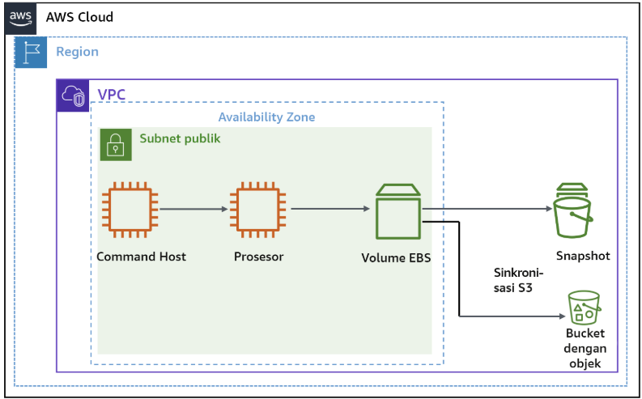
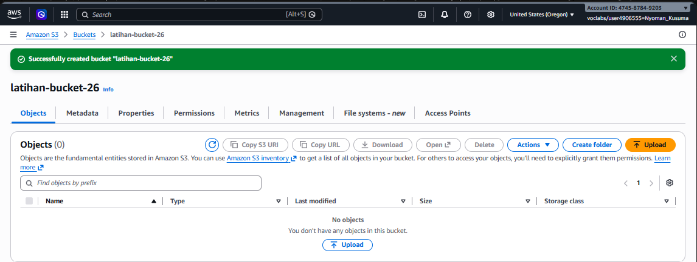
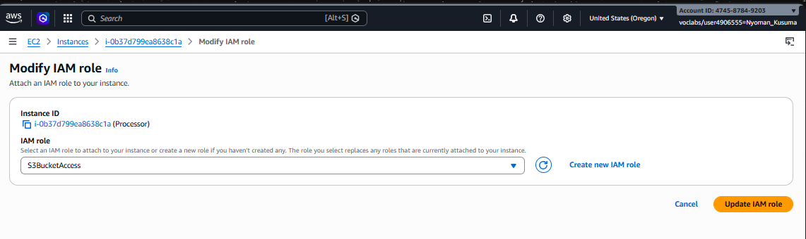
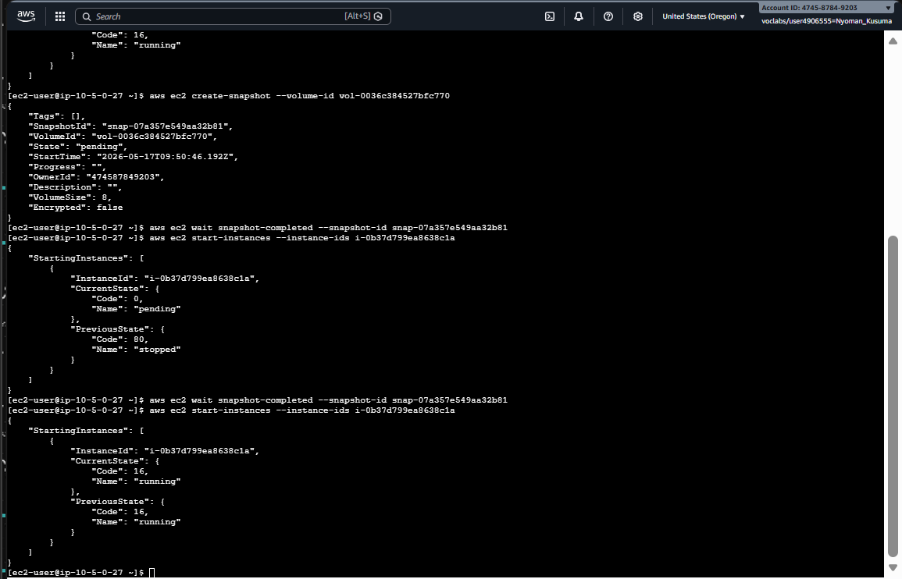
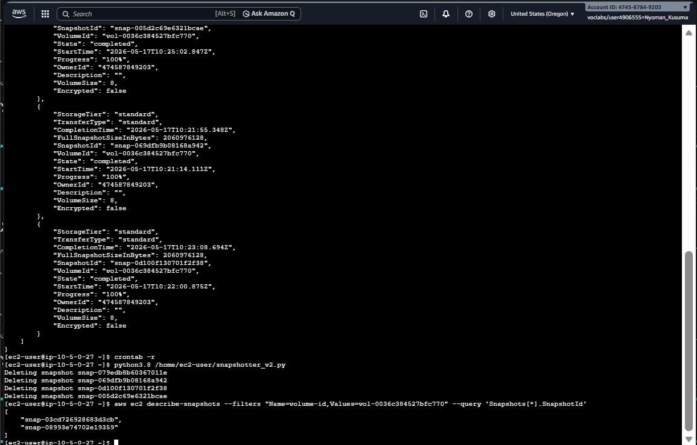
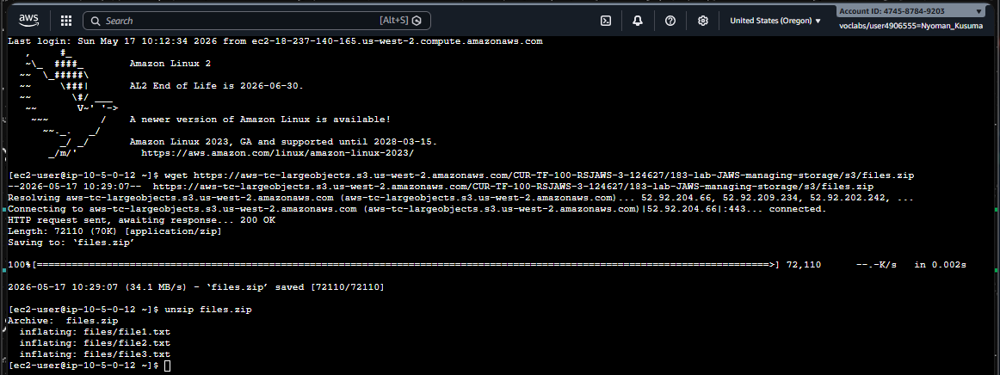
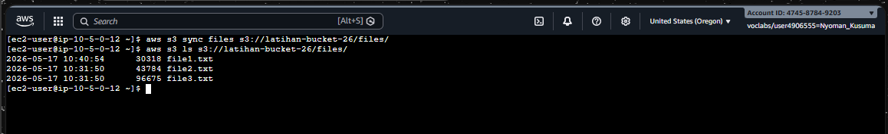
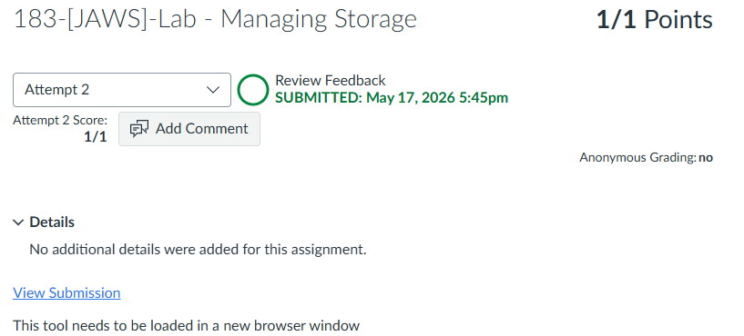

# 183-[JAWS]-Lab - Managing Storage

> Panduan membuat bucket S3, mengotomatiskan EBS snapshot, dan menyinkronkan file dengan Amazon S3 beserta fitur versioning.


---

## Tugas 1 — Membuat & Mengonfigurasi Sumber Daya

### 1.1 Buat Bucket S3

1. AWS Console → cari **S3** → klik **Create bucket**
2. Konfigurasi:
   - **Bucket name:** nama unik global, contoh: `cloud-lab-processor-storage-[NAMA]` → catat sebagai `s3-bucket-name`
   - **Region:** biarkan default
3. Scroll ke bawah → klik **Create bucket**


---

### 1.2 Lampirkan IAM Role ke Instans "Processor"

1. AWS Console → **EC2 → Instances**
2. Centang instans **Processor**
3. Klik **Actions → Security → Modify IAM role**
4. Pilih role **S3BucketAccess** → klik **Update IAM role**


---

## Tugas 2 — Snapshot EBS via AWS CLI

### 2.1 & 2.2 Koneksi & Snapshot Awal

Buka instans **Command Host** → klik **Connect → EC2 Instance Connect → Connect**

Jalankan perintah berikut secara berurutan di terminal:

```bash
# Langkah 1: Dapatkan Volume ID instans Processor
aws ec2 describe-instances \
  --filter 'Name=tag:Name,Values=Processor' \
  --query 'Reservations[0].Instances[0].BlockDeviceMappings[0].Ebs.{VolumeId:VolumeId}'
# Catat: vol-xxxxxxxxx

# Langkah 2: Dapatkan Instance ID instans Processor
aws ec2 describe-instances \
  --filters 'Name=tag:Name,Values=Processor' \
  --query 'Reservations[0].Instances[0].InstanceId'
# Catat: i-xxxxxxxxx

# Langkah 3: Hentikan instans Processor
aws ec2 stop-instances --instance-ids INSTANCE-ID

# Langkah 4: Tunggu hingga instans benar-benar stopped
aws ec2 wait instance-stopped --instance-ids INSTANCE-ID

# Langkah 5: Buat snapshot pertama
aws ec2 create-snapshot --volume-id VOLUME-ID
# Catat: snap-xxxxxxxxx

# Langkah 6: Tunggu snapshot selesai
aws ec2 wait snapshot-completed --snapshot-id SNAPSHOT-ID

# Langkah 7: Jalankan kembali instans Processor
aws ec2 start-instances --instance-ids INSTANCE-ID
```


---

### 2.3 & 2.4 Otomatisasi Snapshot (Cron & Python)

```bash
# Jadwalkan snapshot setiap menit via cron
echo "* * * * *  aws ec2 create-snapshot --volume-id vol-00a8280b92cd0a82c >> /tmp/cronlog 2>&1" > cronjob
crontab cronjob
```
image

Tunggu **2–3 menit** agar beberapa snapshot terbuat otomatis.

```bash
# Periksa snapshot yang terbuat
aws ec2 describe-snapshots --filters "Name=volume-id,Values=VOLUME-ID"

# Hapus cron job
crontab -r

# Jalankan skrip Python — sisakan hanya 2 snapshot terbaru
python3.8 /home/ec2-user/snapshotter_v2.py

# Verifikasi sisa snapshot
aws ec2 describe-snapshots \
  --filters "Name=volume-id,Values=VOLUME-ID" \
  --query 'Snapshots[*].SnapshotId'
```


---

## Tugas 3 — Sinkronisasi File dengan Amazon S3

Hubungkan ke instans **Processor** (bukan Command Host) via EC2 Instance Connect.

### 3.1 Unduh & Ekstrak File Sampel

```bash
wget https://aws-tc-largeobjects.s3.us-west-2.amazonaws.com/CUR-TF-100-RSJAWS-3-124627/183-lab-JAWS-managing-storage/s3/files.zip
unzip files.zip
```


---

### 3.2 Sinkronisasi, Simulasi Hapus & Pemulihan

```bash
# Langkah 1: Aktifkan versioning pada bucket S3
aws s3api put-bucket-versioning \
  --bucket S3-BUCKET-NAME \
  --versioning-configuration Status=Enabled

# Langkah 2: Sinkronisasi folder lokal ke S3
aws s3 sync files s3://S3-BUCKET-NAME/files/

# Langkah 3: Hapus file lokal & sinkronisasi ulang dengan --delete
rm files/file1.txt
aws s3 sync files s3://S3-BUCKET-NAME/files/ --delete
# S3 memberi Delete Marker pada file1.txt — file tidak benar-benar hilang

# Langkah 4: Audit versi — cari VersionId file1.txt sebelum dihapus
aws s3api list-object-versions \
  --bucket S3-BUCKET-NAME \
  --prefix files/file1.txt
# Salin VersionId dari blok "Versions"

# Langkah 5: Pulihkan file berdasarkan VersionId
aws s3api get-object \
  --bucket S3-BUCKET-NAME \
  --key files/file1.txt \
  --version-id VERSION-ID \
  files/file1.txt

# Langkah 6: Verifikasi lokal & sinkronisasi ulang ke S3
ls files
aws s3 sync files s3://S3-BUCKET-NAME/files/

# Langkah 7: Audit akhir — pastikan file kembali aktif di S3
aws s3 ls s3://S3-BUCKET-NAME/files/
```


---

### Alur Versioning S3

```
Upload file1.txt          →  Versi aktif tersimpan
aws s3 sync --delete      →  Delete Marker ditambahkan (versi lama tetap ada)
get-object --version-id   →  Unduh versi spesifik sebelum dihapus
aws s3 sync               →  File dipulihkan kembali ke S3
```

---

### Referensi Perintah

| Perintah | Fungsi |
|---|---|
| `aws ec2 create-snapshot` | Buat snapshot EBS |
| `aws ec2 wait snapshot-completed` | Tunggu snapshot selesai |
| `aws s3 sync` | Sinkronisasi folder lokal ke S3 |
| `aws s3 sync --delete` | Sinkronisasi + hapus objek yang tidak ada lokal |
| `aws s3api put-bucket-versioning` | Aktifkan versioning bucket |
| `aws s3api list-object-versions` | Lihat semua versi objek |
| `aws s3api get-object --version-id` | Unduh versi spesifik objek |
| `crontab -r` | Hapus semua cron job aktif |

---

## Kesimpulan — Praktik Terbaik Cloud

| Praktik | Manfaat |
|---|---|
| IAM Instance Profile | Hindari hardcoded credentials di dalam EC2 |
| EBS Snapshot otomatis + retensi | Hemat biaya, data terlindungi |
| S3 Sync + Bucket Versioning | Mitigasi risiko kehilangan data akibat human error |

---

> ⚠️ **Penting:** Flag `--delete` pada `aws s3 sync` bersifat destruktif di sisi S3. Selalu aktifkan **Bucket Versioning** sebelum menggunakannya agar file yang terhapus masih bisa dipulihkan.

---

---

<div align="center">

☁️ **AWS re/Start Program** &nbsp;·&nbsp; Hands-on Lab: Managing Storage &nbsp;·&nbsp; ✅ Completed

</div>