<div align="center">

# ☁️ Hands-on Lab — Introduction to Amazon EC2

**AWS re/Start Program · Hands-on Lab**


</div>

---

> Amazon EC2 menyediakan kapasitas komputasi virtual yang fleksibel dengan model **pay-as-you-go**. Dalam lab ini kamu akan meluncurkan, mengonfigurasi, memantau, melakukan scaling, dan menghapus sebuah web server di AWS.

---

## 🎯 Objektif Lab

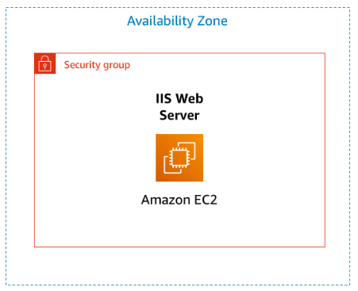

|  |  |
|:-:|----------|
| `1` | Luncurkan instans EC2 dengan **Termination Protection** & **User Data** script |
| `2` | Pantau metrik instans via **CloudWatch** |
| `3` | Buka port HTTP di **Security Group** |
| `4` | **Scaling Up** — ubah instance type & perbesar EBS volume |
| `5` | Uji & nonaktifkan **Termination Protection** |

---

## 🚀 Tugas 1  Meluncurkan Instans EC2

> Launch web server dengan Apache yang terinstal otomatis via User Data script.

**Langkah 1  Akses dashboard**

Di AWS Console cari dan pilih **EC2**, lalu klik **Launch Instance**.

**Langkah 2  Konfigurasi dasar**

| Pengaturan | Nilai |
|---|---|
| Name | `Web Server` |
| AMI | `Amazon Linux 2023` *(default)* |
| Instance Type | `t3.micro` |
| Key Pair | `Proceed without a key pair` |
| Storage | `8 GiB` *(default)* |

**Langkah 3  Network settings**

Klik **Edit**, lalu isi:

- **VPC** → `Lab VPC`
- **Security Group Name** → `Web Server security group`
- **Description** → `Security group for my web server`
- Hapus aturan **SSH** default

**Langkah 4  Advanced details · User Data**

Aktifkan **Termination Protection** → `Enable`, lalu tempel script berikut:

```bash
#!/bin/bash
yum -y install httpd
systemctl enable httpd
systemctl start httpd
echo '<html><h1>Hello From Your Web Server!</h1></html>' > /var/www/html/index.html
```

**Langkah 5  Launch & verifikasi**

Klik **Launch instance** → **View all instances**.

> ✅ **Sukses** — Instance State: `Running` dan Status Checks: `2/2 checks passed`

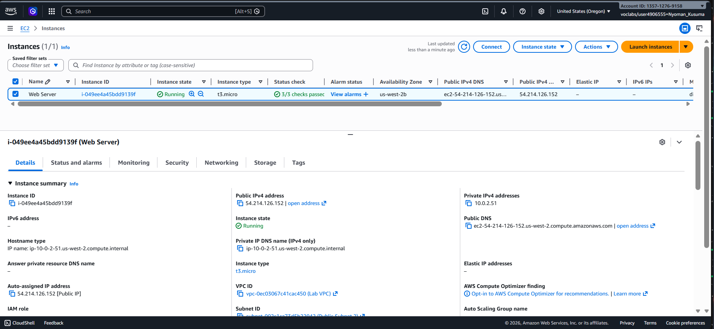

---

## 📊 Tugas 2 Memantau Instans

> Pelajari cara memantau kesehatan dan metrik dasar instans EC2.

**Langkah 1  Status check**

Klik instans **Web Server** → tab **Status checks** untuk melihat metrik kesehatan hardware & software.

**Langkah 2  Monitoring CloudWatch**

Tab **Monitoring** → lihat grafik metrik:

- CPU Utilization
- Network In / Out
- Disk Read / Write

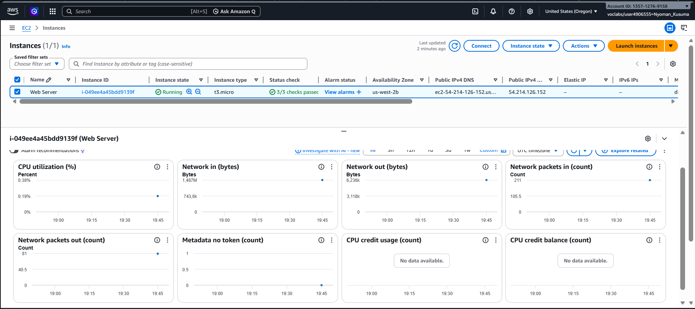

**Langkah 3  Instance screenshot**

```
Actions → Monitor and troubleshoot → Get instance screenshot
```
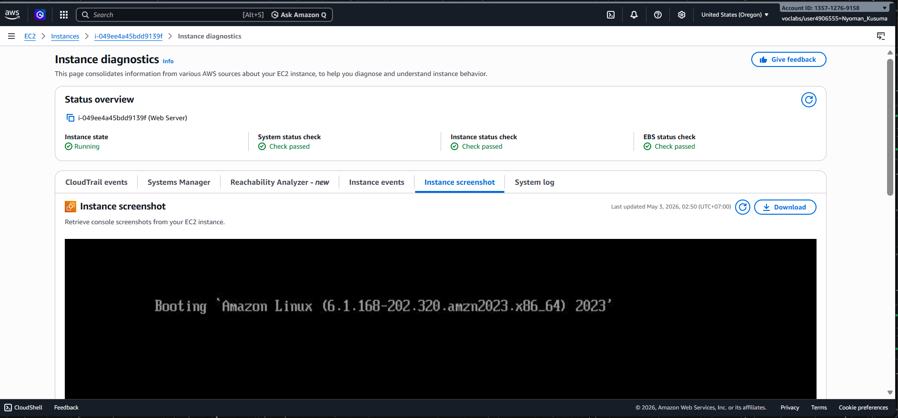

> 💡 **Info** — Screenshot instans berguna untuk troubleshooting tampilan konsol tanpa perlu koneksi SSH langsung.

---

## 🔓 Tugas 3  Update Security Group

> Buka port 80 (HTTP) agar web server dapat diakses publik.

**Langkah 1  Uji akses awal**

Salin **Public IPv4 address** dari tab Details, buka di tab browser baru.

> ⚠️ **Peringatan** — Halaman akan timeout. Normal! Port 80 masih tertutup di Security Group.

**Langkah 2  Edit inbound rules**

```
Panel kiri EC2 → Security Groups → Web Server security group
→ Tab Inbound rules → Edit inbound rules
```
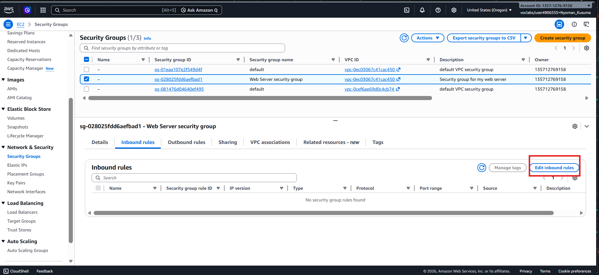

**Langkah 3  Tambah aturan HTTP**

| Field | Nilai |
|---|---|
| Type | `HTTP` |
| Source | `Anywhere-IPv4 (0.0.0.0/0)` |

Klik **Save rules**.

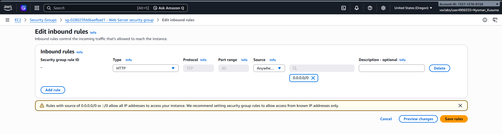

**Langkah 4  Verifikasi**

Refresh tab browser sebelumnya.

> ✅ **Sukses** — Muncul teks: **"Hello From Your Web Server!"**

---

## ⚙️ Tugas 4  Scaling Up

> Simulasi peningkatan performa komputasi dan kapasitas penyimpanan.

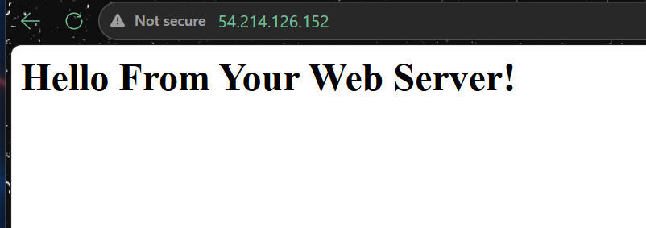

### A  Hentikan instans

```
Instances → centang Web Server → Instance state → Stop instance
```
Tunggu status berubah menjadi `Stopped`.

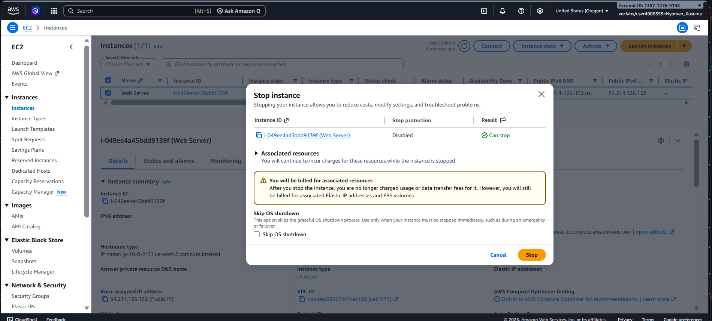

### B  Ubah tipe instans

```
Actions → Instance settings → Change instance type
```

| | Sebelum | Sesudah |
|---|:-:|:-:|
| Instance Type | `t3.micro` | `t3.small` |

Klik **Apply**.

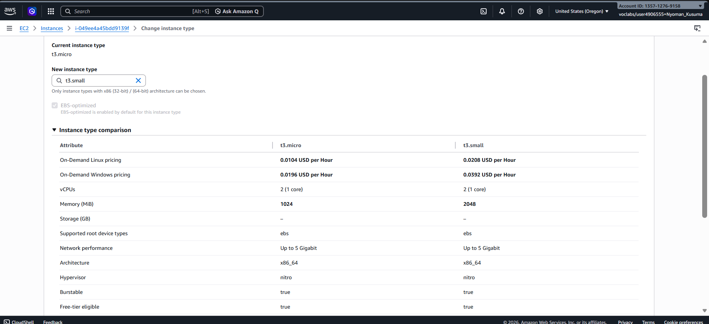

### C  Perbesar volume EBS

```
Elastic Block Store → Volumes → centang volume
→ Actions → Modify volume
```

| | Sebelum | Sesudah |
|---|:-:|:-:|
| Storage | `8 GiB` | `10 GiB` |

Klik **Modify** → konfirmasi **Modify**.

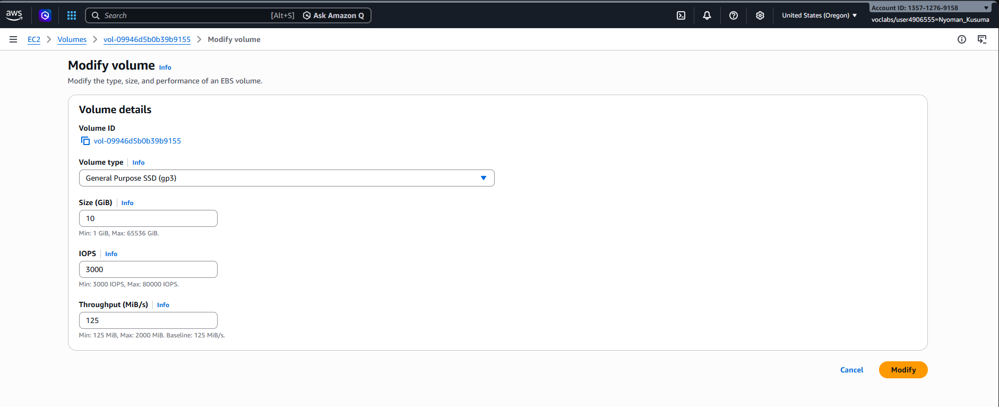

### D  Nyalakan kembali

```
Instances → centang Web Server → Instance state → Start instance
```

> 💡 **Info** — Scaling selesai: `t3.micro → t3.small` · storage `8 GiB → 10 GiB`

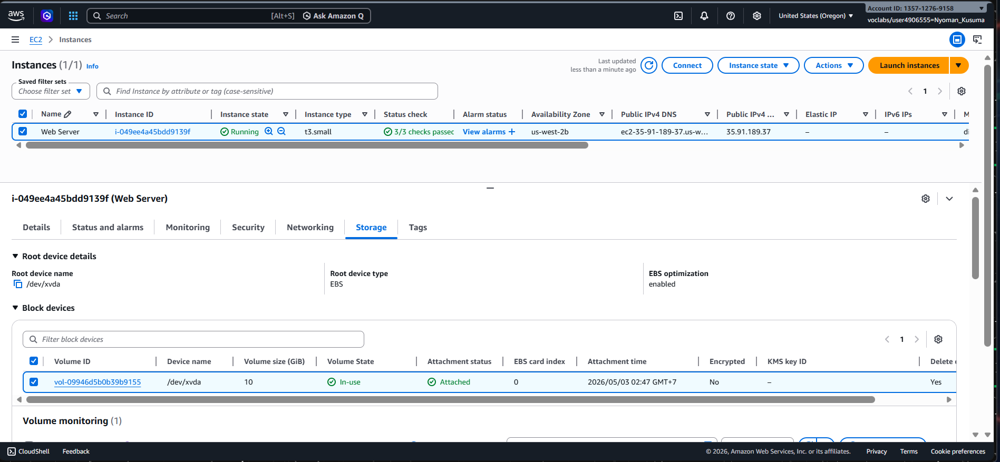

---

## 🛡️ Tugas 5  Uji Termination Protection

> Verifikasi lapisan keamanan dari penghapusan instans secara tidak sengaja.

**Langkah 1  Uji hapus (akan gagal)**

```
Instance state → Terminate instance → Terminate
```
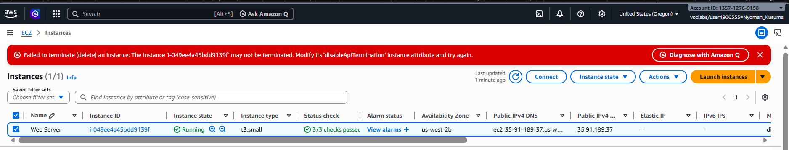

> ❌ **Error** — Penghapusan diblokir oleh Termination Protection yang masih aktif.

**Langkah 2  Nonaktifkan proteksi**

```
Actions → Instance settings → Change termination protection
→ Hapus centang Enable → Save
```
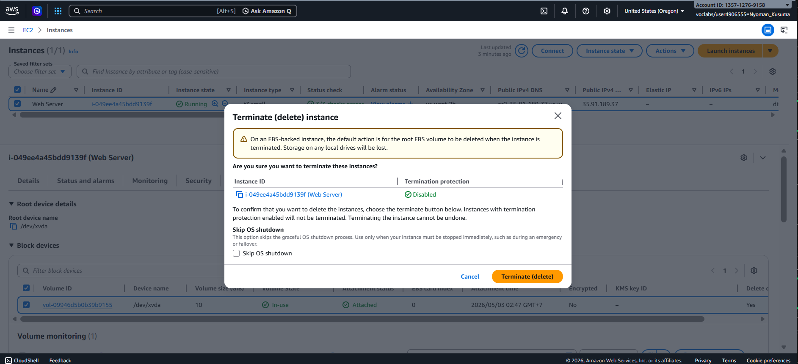

**Langkah 3  Hapus permanen**

```
Instance state → Terminate instance → Terminate
```
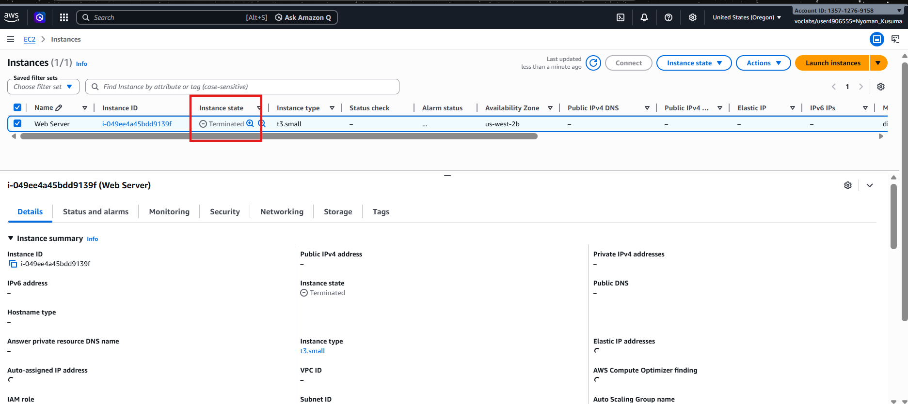

> ✅ **Sukses** — Instans berhasil di-terminate setelah proteksi dinonaktifkan.

---
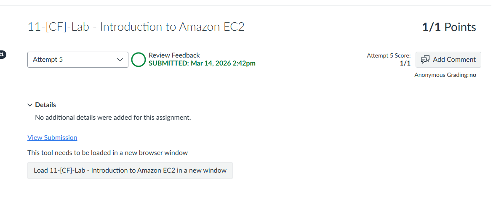
---

## 📋 Ringkasan Konfigurasi

| Komponen | Sebelum | Sesudah |
|---|:-:|:-:|
| Instance Type | `t3.micro` | `t3.small` |
| Storage (EBS) | `8 GiB` | `10 GiB` |
| Port HTTP | Tertutup | `0.0.0.0/0` |
| Termination Protection | `Enabled` | `Disabled` |

---

<div align="center">

☁️ **AWS re/Start Program** &nbsp;·&nbsp; Hands-on Lab: Introduction to Amazon EC2 &nbsp;·&nbsp; ✅ Completed

</div>