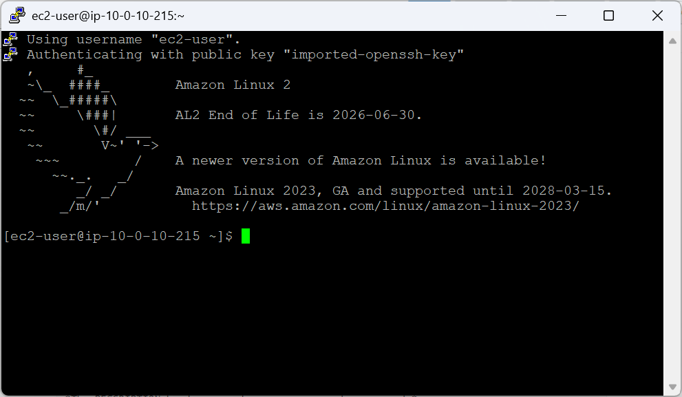
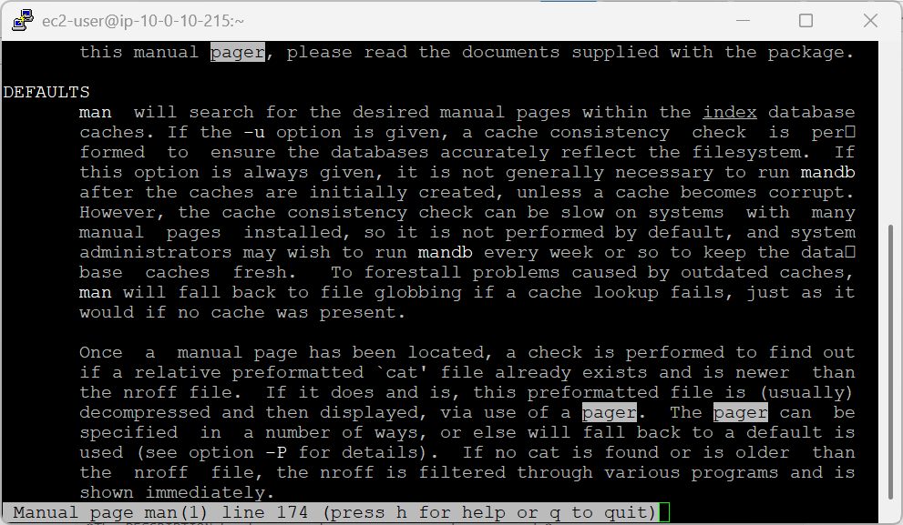
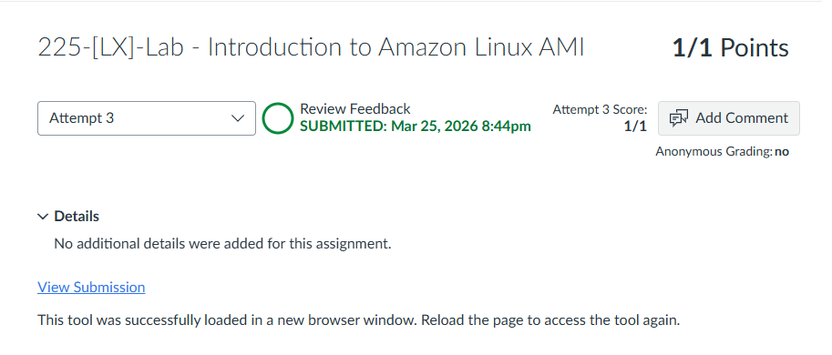

# 225-[LX]-Lab - Introduction to Amazon Linux AMI

> Dokumentasi langkah-langkah penyelesaian Labs.

---

## Tugas 1 — Koneksi SSH ke EC2

### 🪟 Windows (PuTTY)

1. **Unduh kredensial** → `Details > Show > Download PPK` → simpan `labsuser.ppk`
2. **Salin IP Publik** dari panel Details atau EC2 Dashboard
3. **Konfigurasi PuTTY:**
   - **Host Name:** `ec2-user@<IP-PUBLIK>`
   - **Auth:** `Connection > SSH > Auth > Credentials` → Browse → pilih `labsuser.ppk`
4. Klik **Open** → jika muncul peringatan keamanan, klik **Accept**



---

### 🍎 macOS / Linux (Terminal)

1. **Unduh** file `labsuser.pem`

2. **Atur izin file** agar kunci privat tidak dianggap terlalu terbuka:
   ```bash
   chmod 400 labsuser.pem
   ```

3. **Hubungkan** ke server:
   ```bash
   ssh -i labsuser.pem ec2-user@<public-ip>
   ```

4. Ketik **`yes`** saat konfirmasi sidik jari SSH muncul

---

## Tugas 2 — Eksplorasi Linux Man Pages

### Membuka Manual

```bash
man man
```

Perintah ini membuka panduan tentang perintah `man` itu sendiri.

---

### Struktur Man Page

| Bagian | Isi |
|---|---|
| `NAME` | Nama perintah dan deskripsi singkat |
| `SYNOPSIS` | Sintaks dan opsi yang tersedia |
| `DESCRIPTION` | Penjelasan mendalam fungsi perintah |
| `OPTIONS` | Detail setiap argumen (`-v`, `-l`, dll) |
| `EXAMPLES` | Contoh penggunaan praktis |

---

### Navigasi & Pencarian

| Aksi | Tombol |
|---|---|
| Scroll atas/bawah | `↑` / `↓` |
| Cari kata kunci | `/kata` → `Enter` |
| Hasil berikutnya | `n` |
| Keluar | `q` |

**Contoh pencarian:**
```
/pager
```
Lalu tekan `n` untuk berpindah ke hasil berikutnya.



---




<div align="center">

☁️ **AWS re/Start Program** &nbsp;·&nbsp; Hands-on Lab: Introduction to Amazon Linux AMI &nbsp;·&nbsp; ✅ Completed

</div>