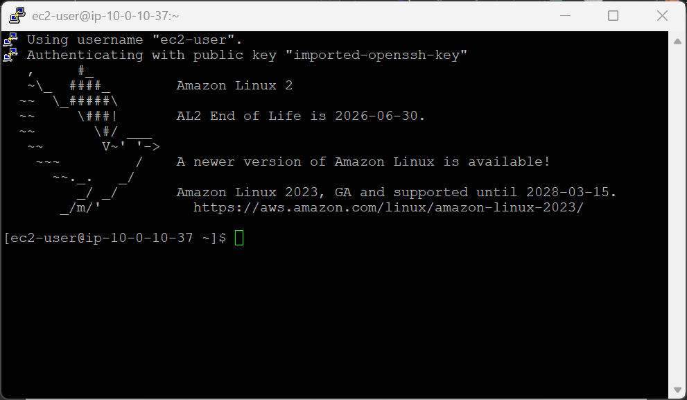
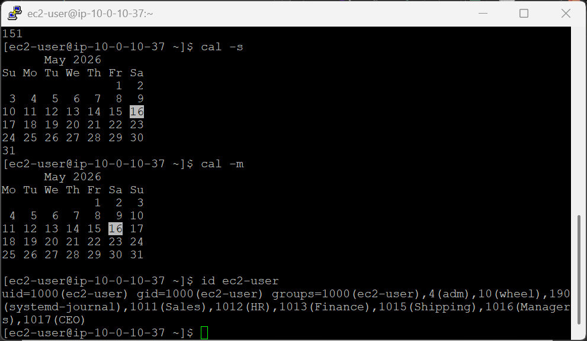
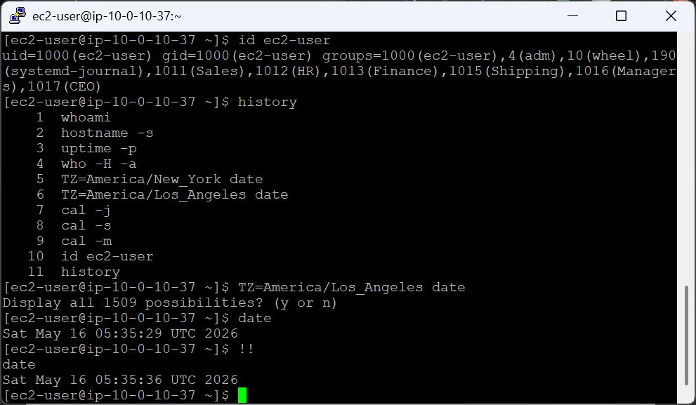
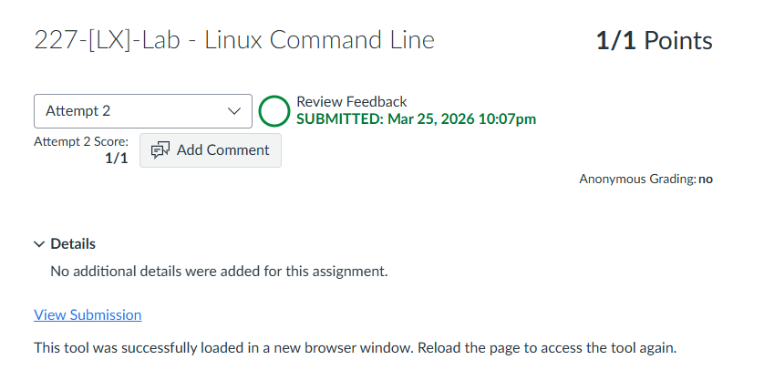

# 227-[LX]-Lab - Linux Command Line

> Dokumentasi panduan koneksi SSH ke Amazon Linux EC2, eksplorasi perintah sistem, dan produktivitas terminal.

---

## Tugas 1 — Koneksi SSH ke EC2

### Langkah Awal (Semua OS)

1. Klik **Details → Show** di halaman instruksi lab
2. Salin nilai **PublicIP**
3. Unduh kunci akses sesuai OS:
   - **Windows:** Download PEM *(disarankan)* atau PPK *(PuTTY)*
   - **Mac/Linux:** Download PEM
4. Tutup panel


---

### 🪟 Windows 10/11 — PowerShell / CMD *(Disarankan)*

> Windows kini punya SSH bawaan — tidak perlu PuTTY lagi.

```powershell
cd Downloads
ssh -i labsuser.pem ec2-user@<public-ip>
```

Ketik **`yes`** saat konfirmasi muncul. Langsung masuk!

> **Masih ingin pakai PuTTY?** Buka PuTTY → masukkan `ec2-user@<public-ip>` → `Connection > SSH > Auth > Credentials` → pilih file `.ppk`

---

### 🍎 macOS / Linux — Terminal

```bash
cd ~/Downloads
chmod 400 labsuser.pem          # Wajib: atur izin file kunci
ssh -i labsuser.pem ec2-user@<public-ip>
```

Ketik **`yes`** untuk melanjutkan. Masuk tanpa password!

---

## Tugas 2 — Perintah Dasar Linux

### Informasi Sistem

| Perintah | Fungsi |
|---|---|
| `whoami` | Nama pengguna aktif (`ec2-user`) |
| `hostname -s` | Nama server singkat (contoh: `ip-10-x-x-x`) |
| `uptime -p` | Lama server menyala sejak booting terakhir |
| `who -H -a` | Daftar pengguna yang sedang login + detail PID & idle |
| `id ec2-user` | UID, GID, dan daftar grup pengguna |

> 💡 **Tip autocomplete:** Ketik `whoa` lalu tekan **Tab** → terminal otomatis melengkapi menjadi `whoami`

---

### Waktu & Zona Waktu

```bash
TZ=America/New_York date        # Waktu di New York
TZ=America/Los_Angeles date     # Waktu di Los Angeles
```

Variabel `TZ` mengubah zona waktu **sementara** hanya untuk perintah tersebut.

---

### Kalender

```bash
cal -j    # Format Julian (hari ke-1 s/d 365)
cal -s    # Minggu dimulai hari Minggu
cal -m    # Minggu dimulai hari Senin
```

---

---

## Tugas 3 — Riwayat & Pencarian Perintah

### Lihat Riwayat

```bash
history
```

Menampilkan semua perintah yang pernah diketik selama sesi ini.

---

### Pencarian Mundur (Reverse Search)

| Aksi | Tombol |
|---|---|
| Buka pencarian | `Ctrl + R` |
| Ketik kata kunci | contoh: `TZ` |
| Munculkan perintah | `→` atau `Tab` |
| Jalankan langsung | `Enter` |

---

### Ulangi Perintah Terakhir

```bash
date    # Jalankan sekali
!!      # Jalankan ulang perintah sebelumnya secara instan
```

`!!` mengeksekusi ulang perintah terakhir tanpa perlu mengetik ulang.

---

---


---
<div align="center">

☁️ **AWS re/Start Program** &nbsp;·&nbsp; Hands-on Lab: Linux Command Line &nbsp;·&nbsp; ✅ Completed

</div>