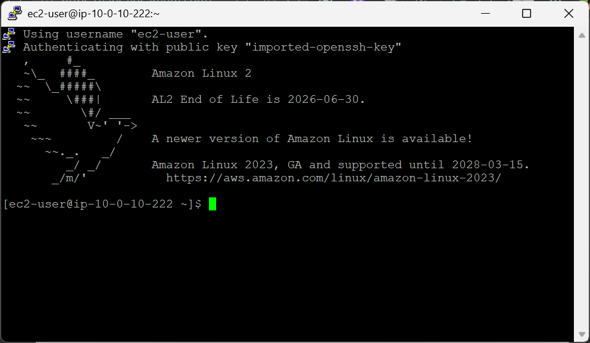
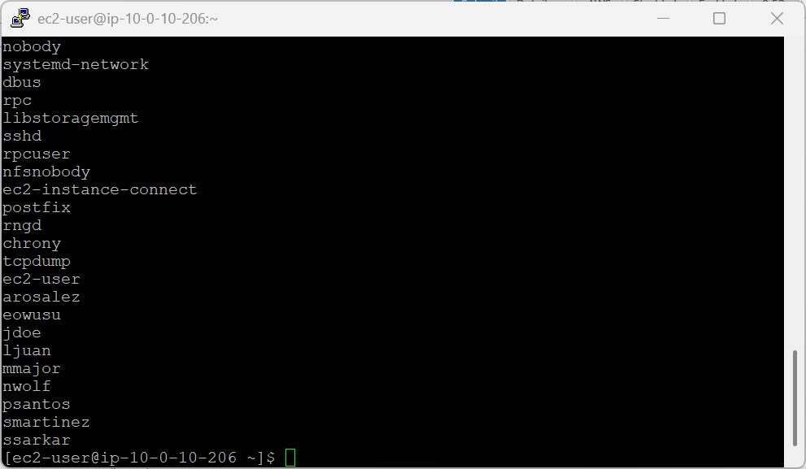
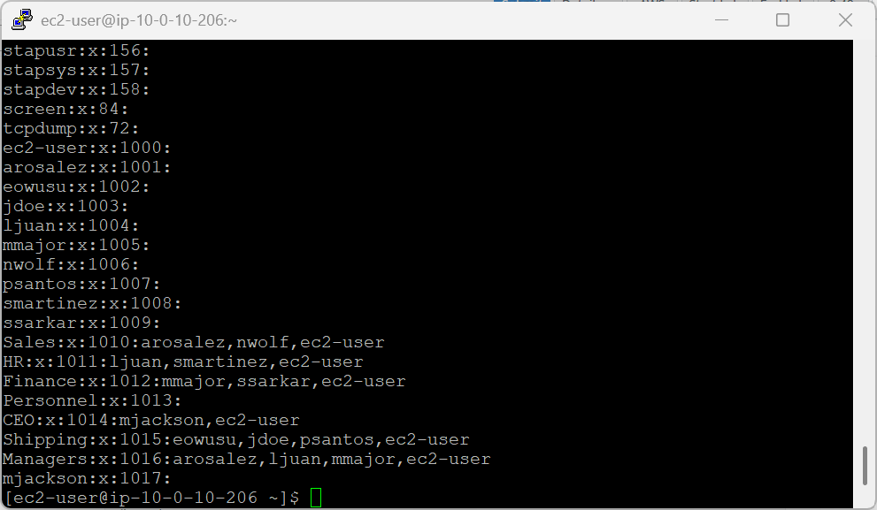
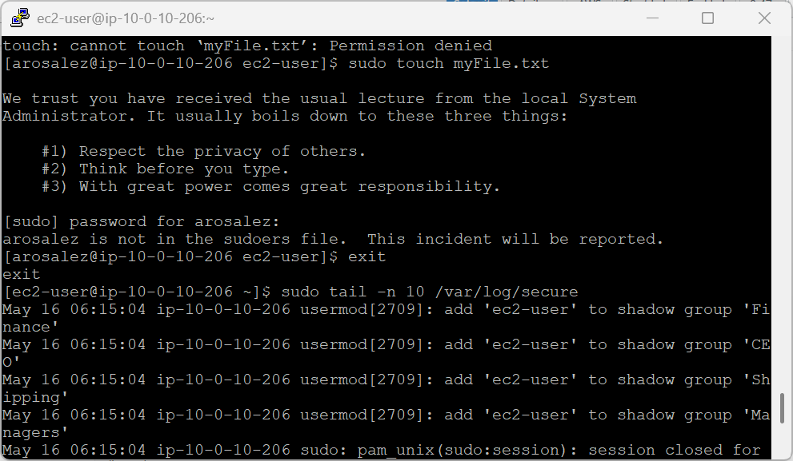
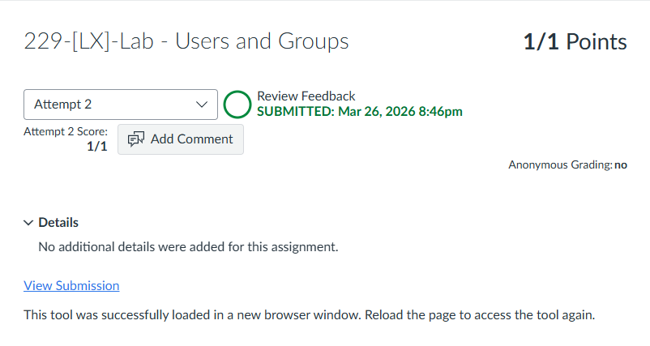

# 229-[LX]-Lab - Users and Groups

> Panduan koneksi SSH ke EC2, membuat pengguna, mengelola grup, dan memahami sistem keamanan Linux.

---

## Tugas 1 — Koneksi SSH ke EC2

### Persiapan

1. Klik **Details → Show** di halaman instruksi lab
2. Salin nilai **PublicIP**
3. Unduh kunci akses:
   - **Windows:** Download PEM *(CMD/PowerShell)* atau PPK *(PuTTY)*
   - **Mac/Linux:** Download PEM
4. Tutup panel

### Koneksi (Mac / Linux / Windows CMD/PowerShell)

```bash
cd ~/Downloads
chmod 400 labsuser.pem          # Khusus macOS/Linux
ssh -i labsuser.pem ec2-user@<public-ip>
```

Ketik **`yes`** saat konfirmasi muncul.

> **PuTTY?** Buka PuTTY → `ec2-user@<public-ip>` → `Connection > SSH > Auth > Credentials` → pilih file `.ppk`


---

## Tugas 2 — Membuat Pengguna

Pastikan berada di direktori home:

```bash
pwd
```

Buat 10 pengguna berikut dan set password **`P@ssword1234!`** untuk masing-masing:

```bash
sudo useradd arosalez && sudo passwd arosalez
sudo useradd eowusu   && sudo passwd eowusu
sudo useradd jdoe     && sudo passwd jdoe
sudo useradd ljuan    && sudo passwd ljuan
sudo useradd mmajor   && sudo passwd mmajor
sudo useradd mjackson && sudo passwd mjackson
sudo useradd nwolf    && sudo passwd nwolf
sudo useradd psantos  && sudo passwd psantos
sudo useradd smartinez && sudo passwd smartinez
sudo useradd ssarkar  && sudo passwd ssarkar
```

> 💡 Saat `passwd` berjalan, ketikan password **tidak muncul di layar** — cukup ketik dan tekan Enter dua kali.

Verifikasi semua pengguna berhasil dibuat:

```bash
sudo cat /etc/passwd | cut -d: -f1
```


---

## Tugas 3 — Membuat Grup & Mengelola Anggota

### Buat Grup

```bash
sudo groupadd Sales
sudo groupadd HR
sudo groupadd Finance
sudo groupadd Personnel
sudo groupadd CEO
sudo groupadd Shipping
sudo groupadd Managers
```

Verifikasi:

```bash
cat /etc/group
```

---

### Masukkan Pengguna ke Grup

```bash
# Sales
sudo usermod -a -G Sales arosalez
sudo usermod -a -G Sales nwolf

# HR
sudo usermod -a -G HR ljuan
sudo usermod -a -G HR smartinez

# Finance
sudo usermod -a -G Finance mmajor
sudo usermod -a -G Finance ssarkar

# Shipping
sudo usermod -a -G Shipping eowusu
sudo usermod -a -G Shipping jdoe
sudo usermod -a -G Shipping psantos

# Managers
sudo usermod -a -G Managers arosalez
sudo usermod -a -G Managers ljuan
sudo usermod -a -G Managers mmajor

# CEO
sudo usermod -a -G CEO mjackson
```

Tambahkan `ec2-user` ke semua grup:

```bash
sudo usermod -a -G Sales,HR,Finance,Shipping,Managers,CEO ec2-user
```

Verifikasi keanggotaan:

```bash
cat /etc/group
```


---

### Ringkasan Keanggotaan Grup

| Grup | Anggota |
|---|---|
| Sales | arosalez, nwolf |
| HR | ljuan, smartinez |
| Finance | mmajor, ssarkar |
| Shipping | eowusu, jdoe, psantos |
| Managers | arosalez, ljuan, mmajor |
| CEO | mjackson |

---

## Tugas 4 — Uji Batasan Akses Pengguna

### Beralih ke pengguna `arosalez`

```bash
su arosalez        # Password: P@ssword1234!
pwd                # Output: /home/ec2-user
```

### Uji izin akses

```bash
touch myFile.txt           # ❌ Permission denied — tidak berhak menulis di folder ec2-user
sudo touch myFile.txt      # ❌ arosalez tidak ada di sudoers — insiden dicatat di log
```

### Kembali ke `ec2-user`

```bash
exit
```

### Cek log keamanan

```bash
sudo tail -n 10 /var/log/secure
```



---

> 🔐 **Poin Penting:** Linux mencatat setiap percobaan akses ilegal secara otomatis di `/var/log/secure` — bukti nyata pentingnya prinsip *least privilege*.
---



---
<div align="center">

☁️ **AWS re/Start Program** &nbsp;·&nbsp; Hands-on Lab: Users and Groups &nbsp;·&nbsp; ✅ Completed

</div>