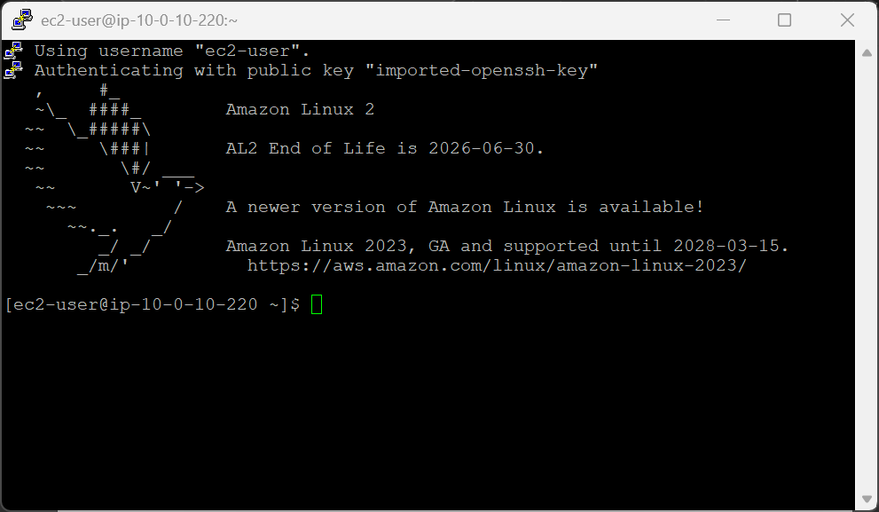
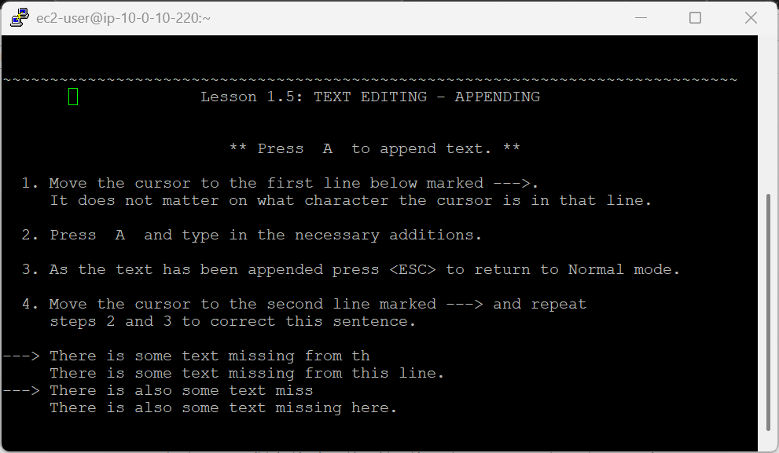
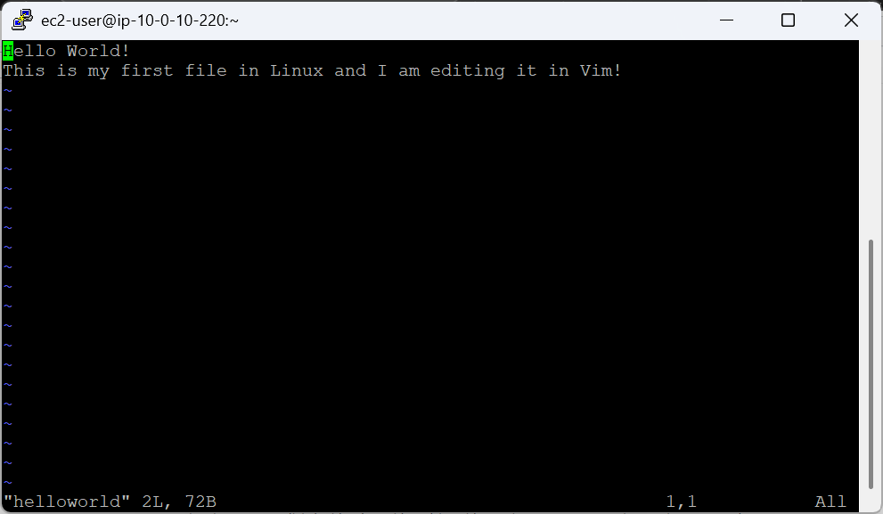
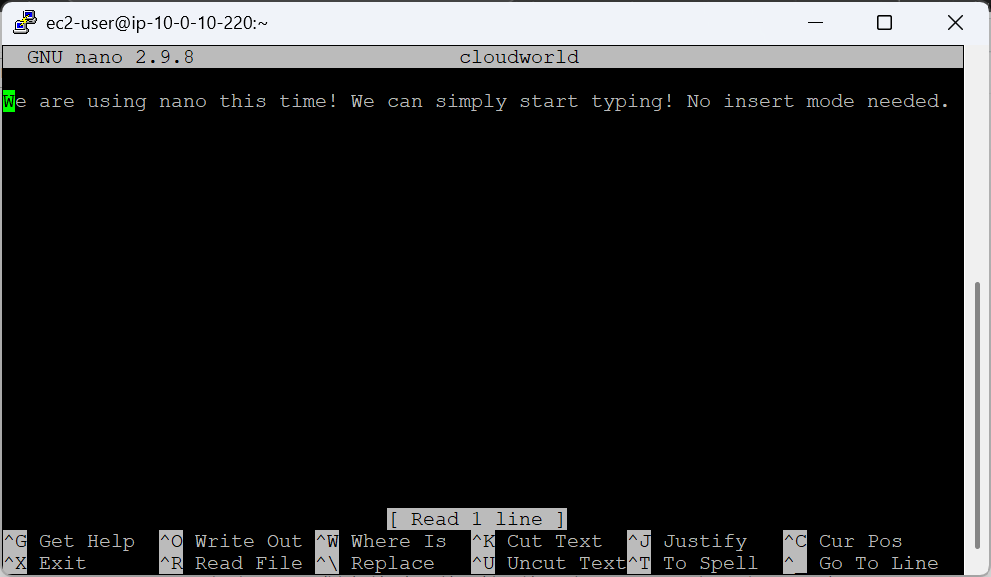
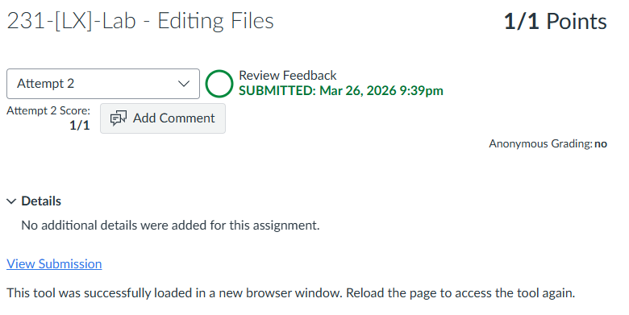

# 231-[LX]-Lab - Editing Files

> Dokumentasi panduan koneksi SSH ke EC2, belajar Vim lewat vimtutor, dan mengedit file dengan Vim & Nano.

---

## Tugas 1 — Koneksi SSH ke EC2

### Persiapan

1. Klik **Details → Show** di halaman instruksi lab
2. Salin nilai **PublicIP**
3. Unduh kunci akses:
   - **Windows:** Download PEM *(CMD/PowerShell)* atau PPK *(PuTTY)*
   - **Mac/Linux:** Download PEM
4. Tutup panel

### Koneksi

```bash
cd ~/Downloads
chmod 400 labsuser.pem          # Khusus macOS/Linux
ssh -i labsuser.pem ec2-user@<public-ip>
```

Ketik **`yes`** saat konfirmasi muncul.


---

## Tugas 2 — Tutorial Vim (vimtutor)

Jalankan sesi tutorial interaktif bawaan Vim:

```bash
vimtutor
```

> Jika perintah tidak ditemukan: `sudo yum install vim`

Ikuti dan selesaikan **Pelajaran 1 hingga 3**. Untuk keluar paksa:

```
:q!  →  Enter
```


---

## Tugas 3 — Mengedit File dengan Vim

### Buat & isi file baru

```bash
vim helloworld
```

| Aksi | Perintah |
|---|---|
| Masuk Insert Mode | `i` |
| Keluar Insert Mode | `Esc` |
| Simpan & keluar | `:wq` → Enter |
| Keluar tanpa simpan | `:q!` → Enter |
| Simpan tanpa keluar | `:w` → Enter |

Ketikkan teks berikut saat Insert Mode aktif *(indikator `-- INSERT --` muncul di kiri bawah)*:

```
Hello World!
This is my first file in Linux and I am editing it in Vim!
```

Tekan `Esc` → simpan dengan `:wq`

---

### Edit & uji "keluar tanpa simpan"

Buka kembali file *(tekan ↑ untuk memanggil perintah sebelumnya)*:

```bash
vim helloworld
```

Tambahkan baris baru:

```
I learned how to create a file, edit and save them too!
```

Tekan `Esc` → keluar **tanpa simpan** dengan `:q!`

Buka lagi untuk membuktikan baris tadi tidak tersimpan:

```bash
vim helloworld
```


---

### Perintah Tambahan Vim

| Perintah | Fungsi |
|---|---|
| `dd` | Hapus satu baris penuh |
| `u` | Undo perubahan terakhir |
---

## Tugas 4 — Mengedit File dengan Nano

Buat dan buka file baru:

```bash
nano cloudworld
```

> Tidak perlu mode khusus — langsung ketik:

```
We are using nano this time! We can simply start typing! No insert mode needed.
```

| Aksi | Shortcut |
|---|---|
| Simpan | `Ctrl + O` → Enter |
| Keluar | `Ctrl + X` |

Verifikasi file tersimpan:

```bash
nano cloudworld
```

Konfirmasi isi sudah benar, lalu keluar dengan `Ctrl + X`.


---

### Vim vs Nano — Perbandingan Singkat

| Aspek | Vim | Nano |
|---|---|---|
| Kurva belajar | Curam | Landai |
| Mode editor | Multi-mode (Normal, Insert) | Langsung ketik |
| Cocok untuk | Power user, scripting | Pemula, edit cepat |
| Keluar | `:q!` atau `:wq` | `Ctrl + X` |

---

> 💡 **Tips:** Kuasai Vim untuk jangka panjang — hampir semua server Linux memilikinya, sementara Nano tidak selalu tersedia.

---

---
<div align="center">

☁️ **AWS re/Start Program** &nbsp;·&nbsp; Hands-on Lab: Editing Files &nbsp;·&nbsp; ✅ Completed

</div>