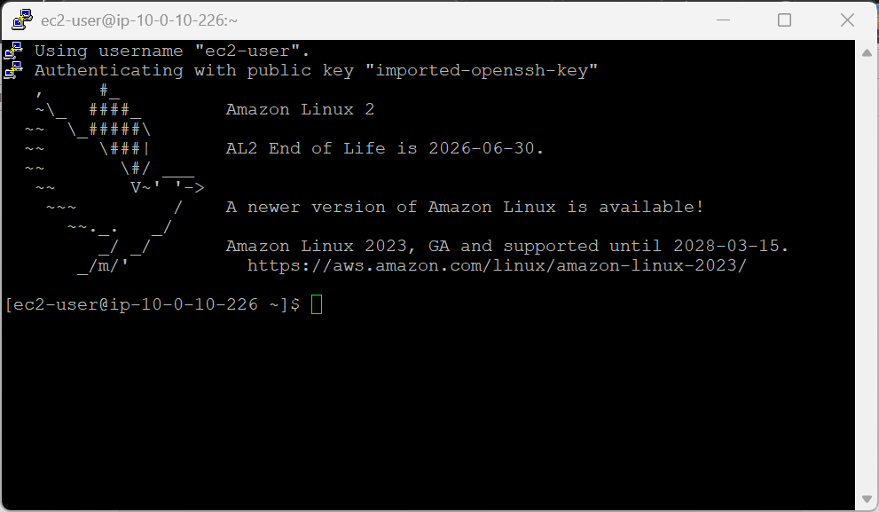
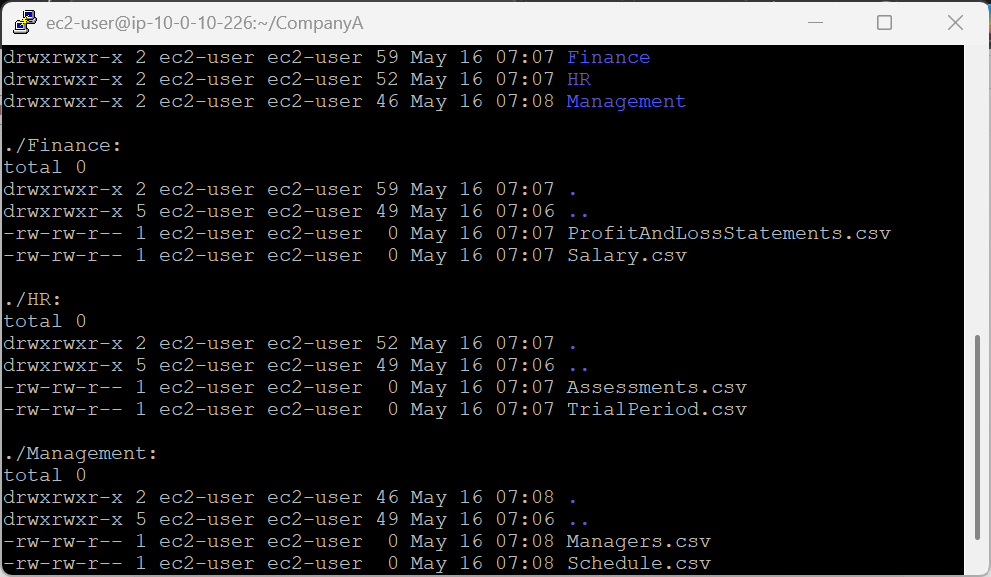
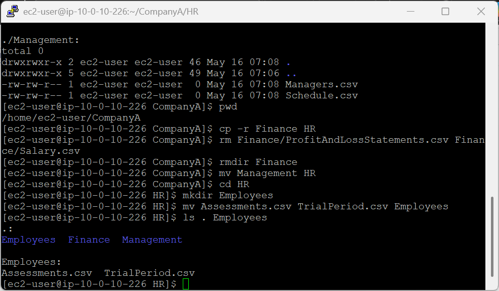
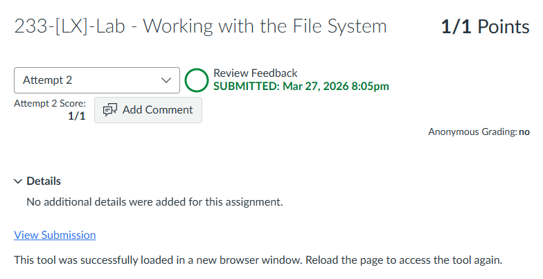

# 233-[LX]-Lab - Working with the File System

> Dokumentasi panduan koneksi SSH ke EC2, membuat struktur folder perusahaan, dan merestrukturisasi direktori.

---

## Tugas 1 — Koneksi SSH ke EC2

### Persiapan

1. Klik **Details → Show** di halaman instruksi lab
2. Salin nilai **PublicIP**
3. Unduh kunci akses:
   - **Windows:** Download PEM *(CMD/PowerShell)* atau PPK *(PuTTY)*
   - **Mac/Linux:** Download PEM
4. Tutup panel

### Koneksi

```bash
cd ~/Downloads
chmod 400 labsuser.pem          # Khusus macOS/Linux
ssh -i labsuser.pem ec2-user@<public-ip>
```

Ketik **`yes`** saat konfirmasi muncul.


---

## Tugas 2 — Membuat Struktur Folder

### Target struktur akhir

```
/home/ec2-user/
└── CompanyA/
    ├── Finance/
    │   ├── Salary.csv
    │   └── ProfitAndLossStatements.csv
    ├── HR/
    │   ├── Assessments.csv
    │   └── TrialPeriod.csv
    └── Management/
        ├── Managers.csv
        └── Schedule.csv
```

### Langkah-langkah

```bash
# Masuk ke home directory & buat folder utama
cd /home/ec2-user
mkdir CompanyA && cd CompanyA

# Buat tiga subdirektori sekaligus
mkdir Finance HR Management

# Buat file di folder HR
cd HR
touch Assessments.csv TrialPeriod.csv

# Buat file di folder Finance
cd ../Finance
touch Salary.csv ProfitAndLossStatements.csv

# Buat file di Management via relative path
cd ..
touch Management/Managers.csv Management/Schedule.csv
```

Verifikasi seluruh struktur:

```bash
ls -laR
```


---

## Tugas 3 — Menghapus & Mengatur Ulang Folder

### Target struktur akhir

```
CompanyA/
└── HR/
    ├── Finance/
    │   ├── Salary.csv
    │   └── ProfitAndLossStatements.csv
    ├── Management/
    │   ├── Managers.csv
    │   └── Schedule.csv
    └── Employees/
        ├── Assessments.csv
        └── TrialPeriod.csv
```

### Langkah-langkah

```bash
# Pastikan berada di CompanyA
pwd    # Output: /home/ec2-user/CompanyA

# Salin Finance beserta isinya ke dalam HR
cp -r Finance HR

# Hapus isi & folder Finance yang asli
rm Finance/ProfitAndLossStatements.csv Finance/Salary.csv
rmdir Finance

# Pindahkan Management ke dalam HR
mv Management HR

# Buat folder Employees & pindahkan file CSV ke dalamnya
cd HR
mkdir Employees
mv Assessments.csv TrialPeriod.csv Employees
```

Verifikasi hasil akhir:

```bash
ls . Employees
```

---

### Referensi Perintah

| Perintah | Fungsi |
|---|---|
| `mkdir` | Buat direktori baru |
| `touch` | Buat file kosong |
| `cp -r` | Salin folder beserta isinya |
| `mv` | Pindahkan file atau folder |
| `rm` | Hapus file |
| `rmdir` | Hapus folder kosong |
| `ls -laR` | Tampilkan semua isi secara rekursif |

---

> 💡 **Tips:** Gunakan `pwd` sesering mungkin untuk memastikan Anda berada di direktori yang benar sebelum menjalankan perintah `rm` atau `mv`.

---

---

<div align="center">

☁️ **AWS re/Start Program** &nbsp;·&nbsp; Hands-on Lab: Working with the File System &nbsp;·&nbsp; ✅ Completed

</div>