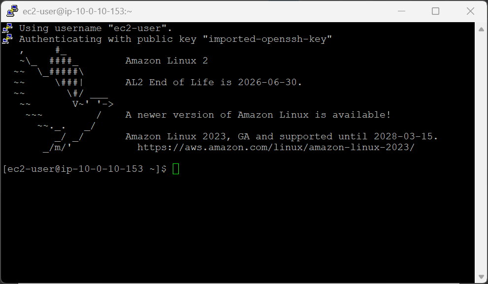
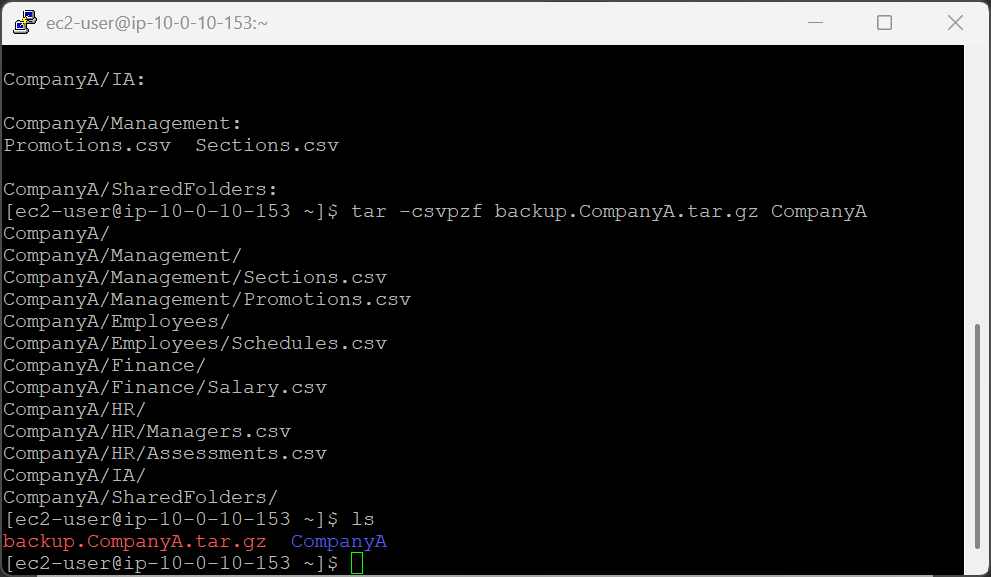
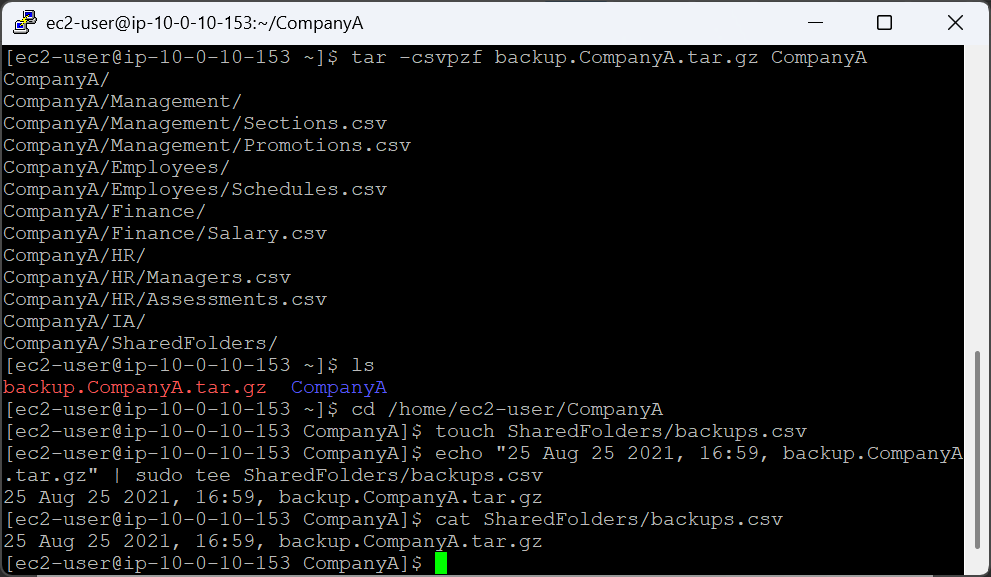
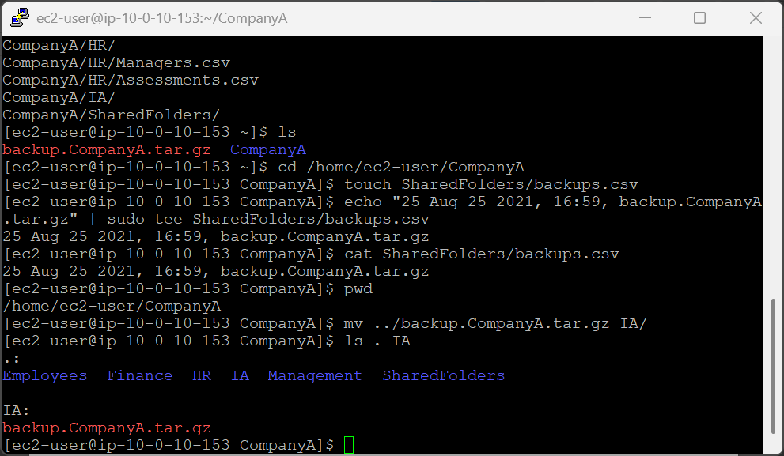
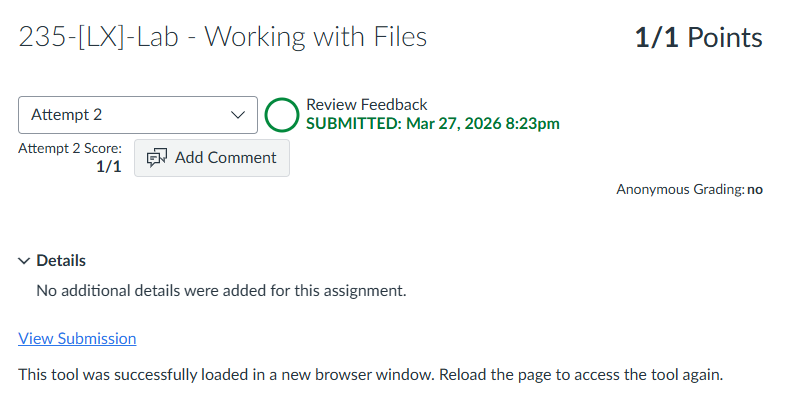

# 235-[LX]-Lab - Working with Files

> Dokementasi panduan koneksi SSH ke EC2, membuat backup terkompresi, mencatat log, dan memindahkan file cadangan.

---

## Tugas 1 — Koneksi SSH ke EC2

### 🪟 Windows (PuTTY)

1. Klik **Details → Show** di halaman instruksi lab
2. Salin **PublicIP** → klik **Download PPK** → simpan `labsuser.ppk`
3. Tutup panel, buka PuTTY → masukkan IP & file `.ppk` di bagian autentikasi SSH

### 🍎 macOS / Linux (Terminal)

```bash
cd ~/Downloads
chmod 400 labsuser.pem          # Wajib: atur izin file kunci
ssh -i labsuser.pem ec2-user@<public-ip>
```

Ketik **`yes`** saat konfirmasi muncul.


---

## Tugas 2 — Membuat Backup

### Validasi awal

```bash
pwd                  # Pastikan berada di /home/ec2-user
ls -R CompanyA       # Tampilkan seluruh isi folder secara rekursif
```

### Buat file arsip terkompresi

```bash
tar -csvpzf backup.CompanyA.tar.gz CompanyA
```

| Opsi | Fungsi |
|---|---|
| `c` | Buat arsip baru |
| `s` | Urutkan nama file |
| `v` | Tampilkan proses (verbose) |
| `p` | Pertahankan izin file |
| `z` | Kompresi gzip |
| `f` | Tentukan nama file output |

Verifikasi file berhasil dibuat:

```bash
ls
```

Output: `backup.CompanyA.tar.gz` muncul berdampingan dengan folder `CompanyA`.

---

## Tugas 3 — Mencatat Log Backup

```bash
cd /home/ec2-user/CompanyA

# Buat file log kosong
touch SharedFolders/backups.csv

# Tulis entri log ke dalam file
echo "25 Aug 25 2021, 16:59, backup.CompanyA.tar.gz" | sudo tee SharedFolders/backups.csv

# Verifikasi isi file
cat SharedFolders/backups.csv
```

> **Cara kerja pipeline:** `echo` mencetak teks → `|` meneruskan ke `tee` → `tee` menulis ke file **sekaligus** menampilkan hasilnya di layar.

---

## Tugas 4 — Memindahkan File Backup

```bash
# Validasi lokasi saat ini
pwd    # Output: /home/ec2-user/CompanyA

# Pindahkan backup dari folder induk ke folder IA
mv ../backup.CompanyA.tar.gz IA/

# Verifikasi hasil
ls . IA
```

> `../` berarti satu tingkat ke atas dari direktori saat ini. File backup akan berpindah dari `/home/ec2-user/` ke `/home/ec2-user/CompanyA/IA/`.

---

### Referensi Perintah

| Perintah | Fungsi |
|---|---|
| `tar -csvpzf` | Buat arsip terkompresi gzip |
| `touch` | Buat file kosong |
| `echo \| tee` | Tulis teks ke file & tampilkan di layar |
| `cat` | Tampilkan isi file |
| `mv` | Pindahkan file atau folder |
| `ls -R` | Tampilkan isi folder secara rekursif |

---

> 💡 **Tips:** Biasakan membuat log setiap kali melakukan backup di lingkungan produksi, catatan ini krusial untuk audit dan pemulihan data.

---

---

<div align="center">

☁️ **AWS re/Start Program** &nbsp;·&nbsp; Hands-on Lab: Working with Files &nbsp;·&nbsp; ✅ Completed

</div>