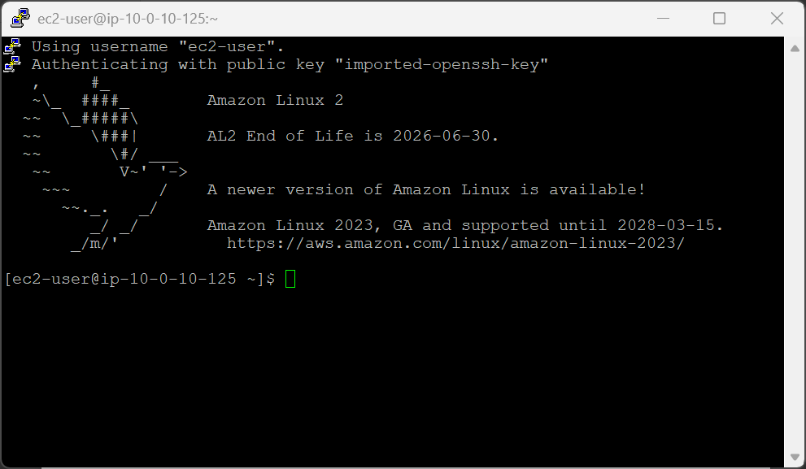
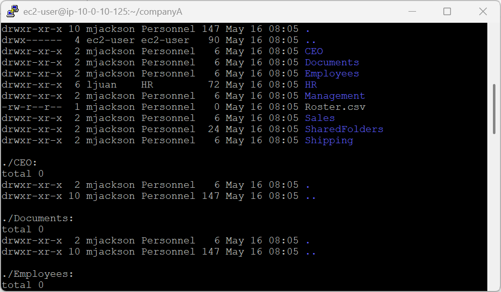
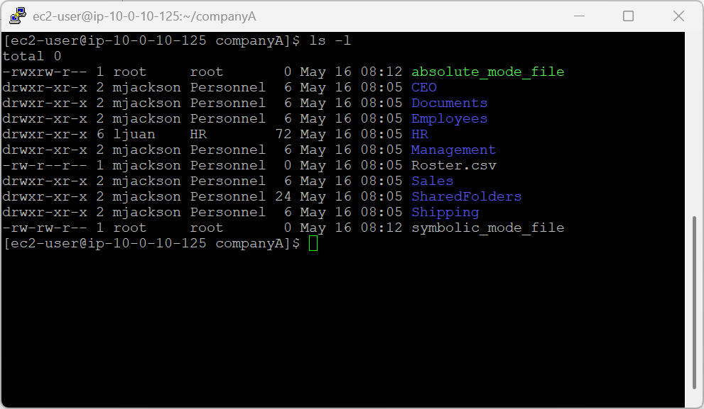
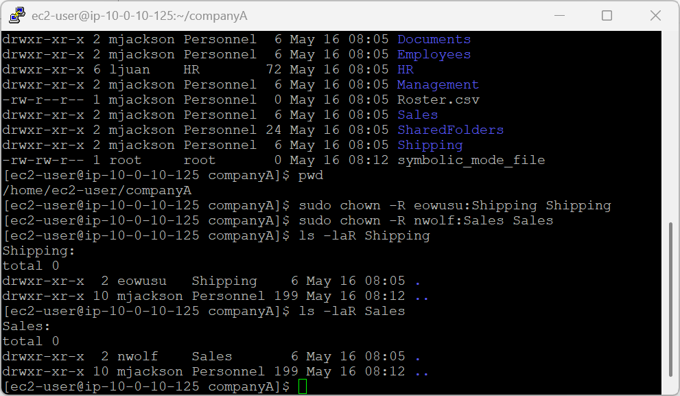
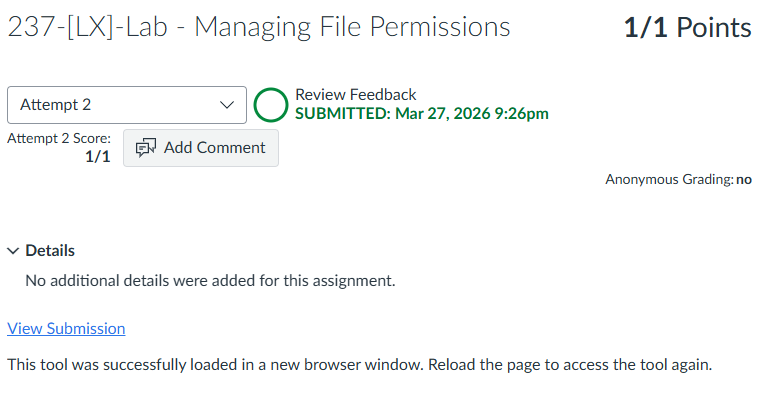

# 237-[LX]-Lab - Managing File Permissions

> Dokumentasi panduan koneksi SSH ke EC2, mengatur kepemilikan file dengan `chown`, dan mengelola izin akses dengan `chmod`.

---

## Tugas 1 — Koneksi SSH ke EC2

### Persiapan

1. Klik **Details → Show** di halaman instruksi lab
2. Salin nilai **PublicIP**
3. Unduh kunci akses:
   - **Windows/Mac/Linux:** Download PEM
   - **Windows (PuTTY):** Download PPK
4. Tutup panel

### Koneksi

```bash
cd ~/Downloads
chmod 400 labsuser.pem          # Khusus macOS/Linux
ssh -i labsuser.pem ec2-user@<public-ip>
```

Ketik **`yes`** saat konfirmasi muncul.


---

## Tugas 2 — Mengubah Kepemilikan File (`chown`)

```bash
# Pastikan berada di folder companyA
pwd && cd companyA

# Ubah kepemilikan seluruh companyA
sudo chown -R mjackson:Personnel /home/ec2-user/companyA

# Ubah kepemilikan folder HR
sudo chown -R ljuan:HR HR

# Ubah kepemilikan folder Finance (di dalam HR)
sudo chown -R mmajor:Finance HR/Finance
```

Verifikasi:

```bash
ls -laR
```



### Ringkasan Kepemilikan

| Folder | Pengguna | Grup |
|---|---|---|
| `companyA` | mjackson | Personnel |
| `HR` | ljuan | HR |
| `HR/Finance` | mmajor | Finance |

> **Sintaks:** `chown -R user:group path` — flag `-R` menerapkan perubahan secara rekursif ke semua subfolder & file.

---

## Tugas 3 — Mengubah Izin Akses (`chmod`)

### A. Mode Simbolik

```bash
sudo vi symbolic_mode_file      # Buat file → ESC → :wq → Enter
sudo chmod g+w symbolic_mode_file
```

| Simbol | Artinya |
|---|---|
| `g` | Group (grup) |
| `+w` | Tambah izin write |

---

### B. Mode Absolut

```bash
sudo vi absolute_mode_file      # Buat file → ESC → :wq → Enter
sudo chmod 764 absolute_mode_file
```

### Cara membaca angka `764`

| Digit | Untuk | Nilai | Izin |
|---|---|---|---|
| `7` | Pemilik (owner) | 4+2+1 | `rwx` |
| `6` | Grup | 4+2 | `rw-` |
| `4` | Lainnya (others) | 4 | `r--` |

> **Nilai referensi:** `r` = 4, `w` = 2, `x` = 1

Verifikasi kedua file:

```bash
ls -l
```

---

## Tugas 4 — Izin Lanjutan (Shipping & Sales)

```bash
# Pastikan berada di /home/ec2-user/companyA
pwd

# Ubah kepemilikan folder Shipping & Sales
sudo chown -R eowusu:Shipping Shipping
sudo chown -R nwolf:Sales Sales
```

Verifikasi:

```bash
ls -laR Shipping
ls -laR Sales
```

### Ringkasan Kepemilikan

| Folder | Pengguna | Grup |
|---|---|---|
| `Shipping` | eowusu | Shipping |
| `Sales` | nwolf | Sales |

---



### Referensi Perintah

| Perintah | Fungsi |
|---|---|
| `chown -R user:group path` | Ubah pemilik & grup secara rekursif |
| `chmod g+w file` | Tambah izin tulis untuk grup (simbolik) |
| `chmod 764 file` | Tetapkan izin spesifik (absolut) |
| `ls -laR` | Tampilkan detail izin secara rekursif |

---

> 💡 **Tips:** Mode absolut (`764`) lebih presisi untuk menetapkan izin lengkap sekaligus, sementara mode simbolik (`g+w`) lebih aman untuk mengubah satu izin tanpa mengganggu yang lain.

---

---

<div align="center">

☁️ **AWS re/Start Program** &nbsp;·&nbsp; Hands-on Lab: Managing File Permissions &nbsp;·&nbsp; ✅ Completed

</div>