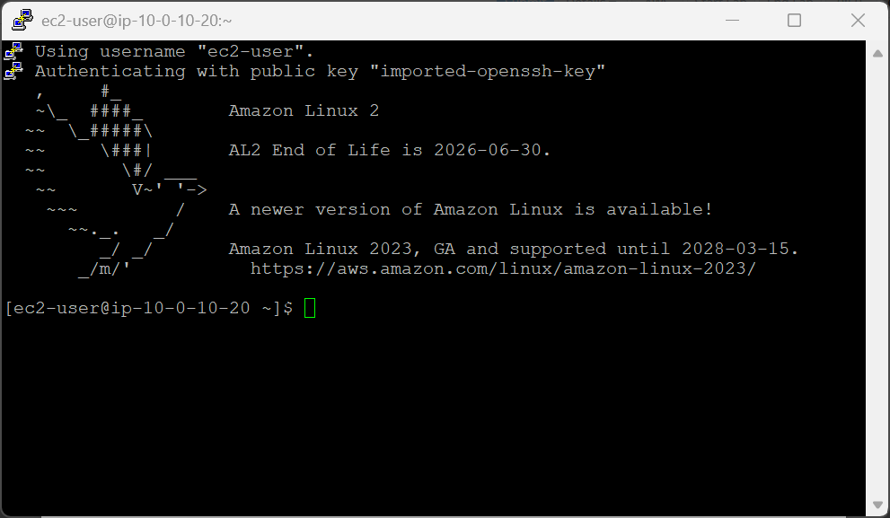
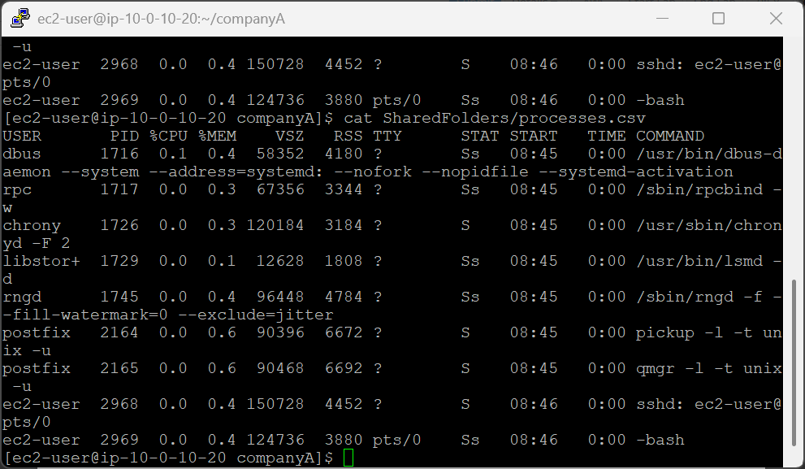
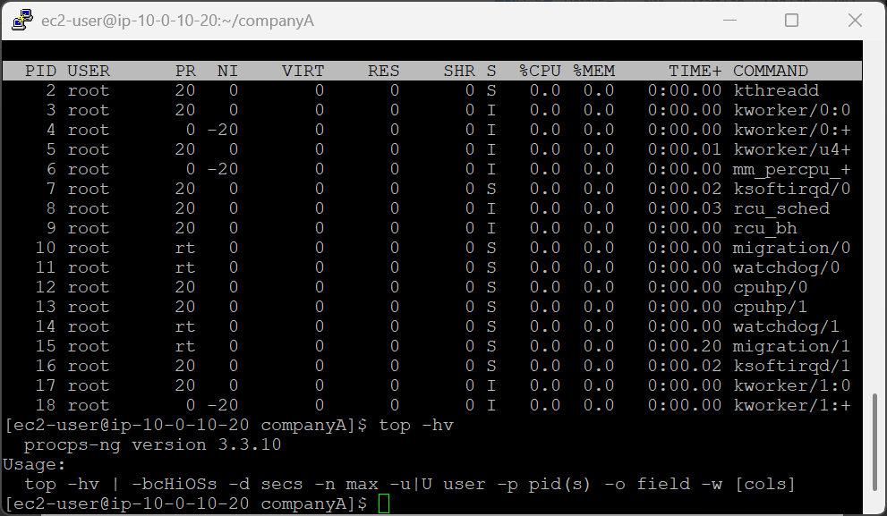
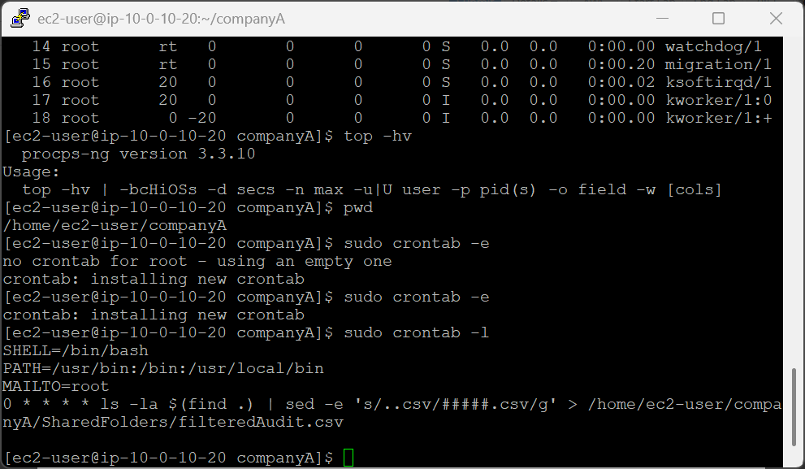
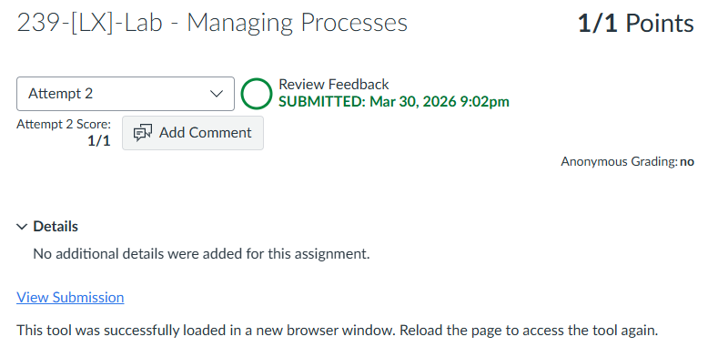

# 239-[LX]-Lab - Managing Processes

> Dokumentasi panduan koneksi SSH ke EC2, mencatat proses sistem, memantau kinerja real-time, dan menjadwalkan tugas otomatis.

---

## Tugas 1 — Koneksi SSH ke EC2

### Persiapan

1. Klik **Details → Show** di halaman instruksi lab
2. Salin nilai **PublicIP**
3. Unduh kunci akses:
   - **Windows/Mac/Linux:** Download PEM
   - **Windows (PuTTY):** Download PPK
4. Tutup panel

### Koneksi

```bash
cd ~/Downloads
chmod 400 labsuser.pem          # Khusus macOS/Linux
ssh -i labsuser.pem ec2-user@<public-ip>
```

Ketik **`yes`** saat konfirmasi muncul.

---

## Tugas 2 — Membuat Daftar Proses (Process Logging)

> Filter proses aktif, kecualikan root, dan simpan hasilnya ke file log.

```bash
cd /home/ec2-user/companyA    # Masuk ke direktori kerja
pwd                            # Validasi lokasi

# Tampilkan proses, kecualikan root, simpan ke file
sudo ps -aux | grep -v root | sudo tee SharedFolders/processes.csv

# Verifikasi isi file
cat SharedFolders/processes.csv
```


**Cara kerja pipeline:**

| Bagian | Fungsi |
|---|---|
| `ps -aux` | Tampilkan semua proses yang berjalan |
| `grep -v root` | Kecualikan baris yang mengandung "root" |
| `tee` | Tulis output ke file & tampilkan di layar |

---

## Tugas 3 — Memantau Kinerja Sistem (`top`)

```bash
top
```

### Informasi yang ditampilkan

| Kolom | Keterangan |
|---|---|
| Tasks | Total proses beserta status (running, sleeping, stopped, zombie) |
| %CPU | Persentase penggunaan CPU |
| %MEM | Persentase penggunaan memori (RAM) |

Tekan **`q`** untuk keluar dari pemantauan.

```bash
top -hv 
```

---

## Tugas 4 — Membuat Cron Job

> Jadwalkan audit file `.csv` secara otomatis setiap jam.

### Buka editor crontab

```bash
cd /home/ec2-user/companyA
sudo crontab -e
```

### Masukkan konfigurasi

Tekan **`i`** untuk masuk ke Insert Mode, lalu ketik:

```bash
SHELL=/bin/bash
PATH=/usr/bin:/bin:/usr/local/bin
MAILTO=root
0 * * * * ls -la $(find .) | sed -e 's/..csv/#####.csv/g' > /home/ec2-user/companyA/SharedFolders/filteredAudit.csv
```

Simpan dan keluar: **`Esc`** → `:wq` → **Enter**

### Verifikasi cron job tersimpan

```bash
sudo crontab -l
```

Pastikan output sama persis dengan konfigurasi yang dimasukkan.

### Memahami jadwal cron `0 * * * *`

```
┌───── Menit   (0 = tepat di menit ke-0)
│ ┌─── Jam     (* = setiap jam)
│ │ ┌─ Hari    (* = setiap hari)
│ │ │ ┌ Bulan  (* = setiap bulan)
│ │ │ │ ┌ Hari dalam seminggu (* = setiap hari)
0 * * * *
```

> Artinya: jalankan setiap jam tepat di menit ke-0 (00:00, 01:00, 02:00, dst).

---

### Referensi Perintah

| Perintah | Fungsi |
|---|---|
| `ps -aux` | Tampilkan semua proses aktif |
| `grep -v kata` | Kecualikan baris yang mengandung kata tertentu |
| `tee file` | Tulis output ke layar & file sekaligus |
| `top` | Monitor kinerja sistem secara real-time |
| `crontab -e` | Edit jadwal cron |
| `crontab -l` | Tampilkan daftar cron job aktif |

---

> 💡 **Tips:** Gunakan [crontab.guru](https://crontab.guru) untuk memvalidasi ekspresi jadwal cron sebelum menyimpannya.

---

---

<div align="center">

☁️ **AWS re/Start Program** &nbsp;·&nbsp; Hands-on Lab: Managing Prosses &nbsp;·&nbsp; ✅ Completed

</div>