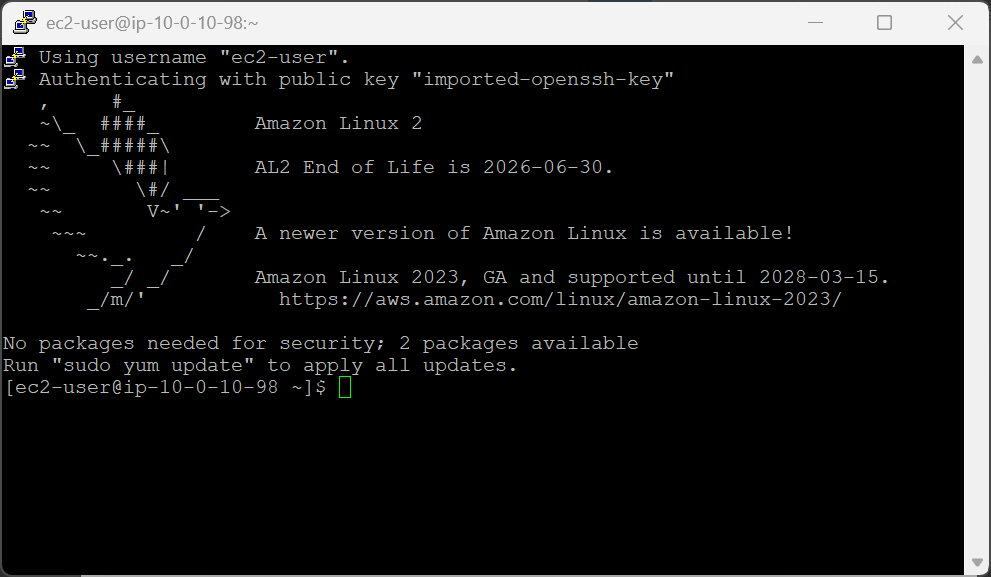
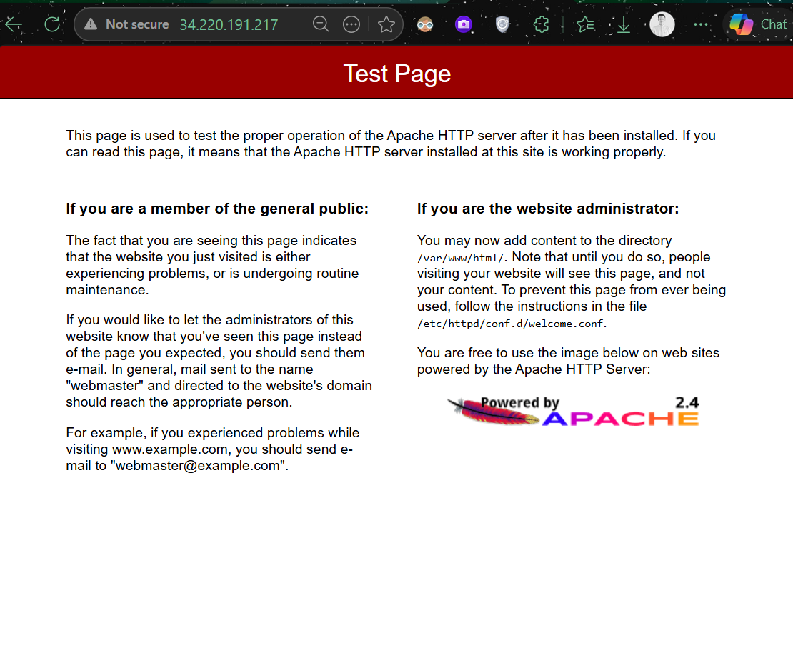
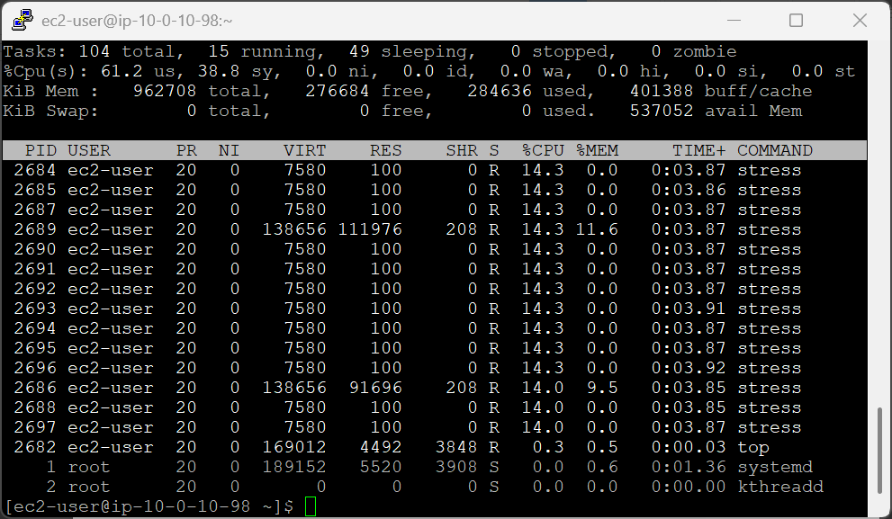
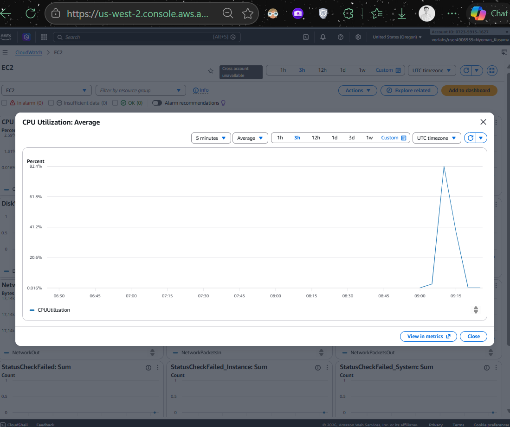
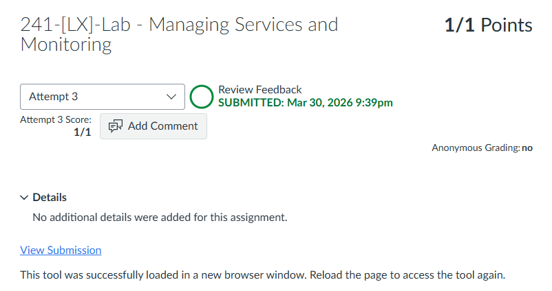

# 241-[LX]-Lab - Managing Services and Monitoring

> Dokumentasi panduan koneksi SSH ke EC2, mengelola layanan Apache httpd, dan memantau kinerja sistem via terminal & AWS CloudWatch.

---

---

## Tugas 1 — Koneksi SSH ke EC2

### Persiapan

1. Klik **Details → Show** di halaman instruksi lab
2. Salin nilai **PublicIP**
3. Unduh kunci akses:
   - **Windows/Mac/Linux:** Download PEM
   - **Windows (PuTTY):** Download PPK
4. Tutup panel

### Koneksi

```bash
cd ~/Downloads
chmod 400 labsuser.pem          # Khusus macOS/Linux
ssh -i labsuser.pem ec2-user@<public-ip>
```

Ketik **`yes`** saat konfirmasi muncul.


---

## Tugas 2 — Mengelola Layanan `httpd`

> Kelola siklus hidup Apache web server menggunakan `systemctl`.

```bash
# Cek status awal (inactive)
sudo systemctl status httpd.service

# Nyalakan layanan
sudo systemctl start httpd.service

# Verifikasi status (active/running)
sudo systemctl status httpd.service
```

Buka browser → akses `http://<public-ip>` → halaman **Apache HTTP Server Test Page** seharusnya muncul.

```bash
# Matikan layanan setelah selesai pengujian
sudo systemctl stop httpd.service
```


### Referensi `systemctl`

| Perintah | Fungsi |
|---|---|
| `systemctl status` | Cek status layanan |
| `systemctl start` | Nyalakan layanan |
| `systemctl stop` | Matikan layanan |
| `systemctl restart` | Restart layanan |
| `systemctl enable` | Aktifkan otomatis saat boot |

---

## Tugas 3 — Monitoring Sistem

### A. Via Terminal

```bash
top                      # Pantau proses & resource real-time (tekan q untuk keluar)
./stress.sh & top        # Jalankan stress test + pantau CPU sekaligus
```

> `stress.sh` mensimulasikan beban CPU tinggi selama ±6 menit. Perhatikan lonjakan penggunaan CPU di bagian atas tampilan `top`.

---

### B. Via AWS CloudWatch

1. Di AWS Console → cari **CloudWatch** → buka
2. Panel kiri → **Dashboards → Automatic dashboards → EC2**
3. Amati grafik **CPU Utilization**

| Fase | Yang Terlihat di Grafik |
|---|---|
| Saat `stress.sh` berjalan | Lonjakan CPU (spike) tinggi |
| ~5 menit setelah berhenti | Grafik turun kembali normal |

> Klik **Refresh** setelah menunggu 5 menit untuk melihat grafik terbaru.


---

> 💡 **Tips:** Kombinasi `./script.sh & top` sangat berguna — `&` menjalankan skrip di background sehingga `top` bisa dipantau di foreground secara bersamaan.

---

---
<div align="center">

☁️ **AWS re/Start Program** &nbsp;·&nbsp; Hands-on Lab: Managing Service and Monitoring &nbsp;·&nbsp; ✅ Completed

</div>