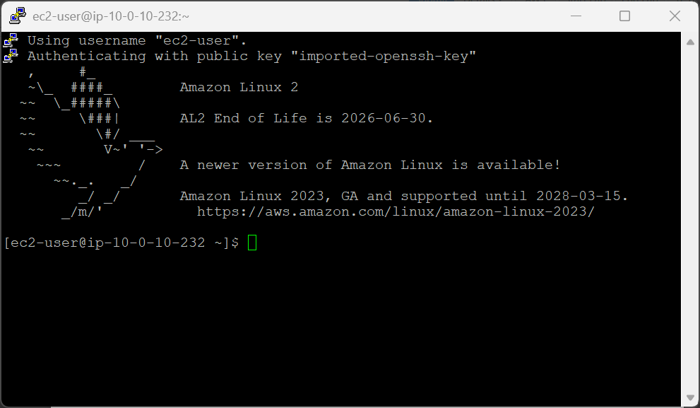
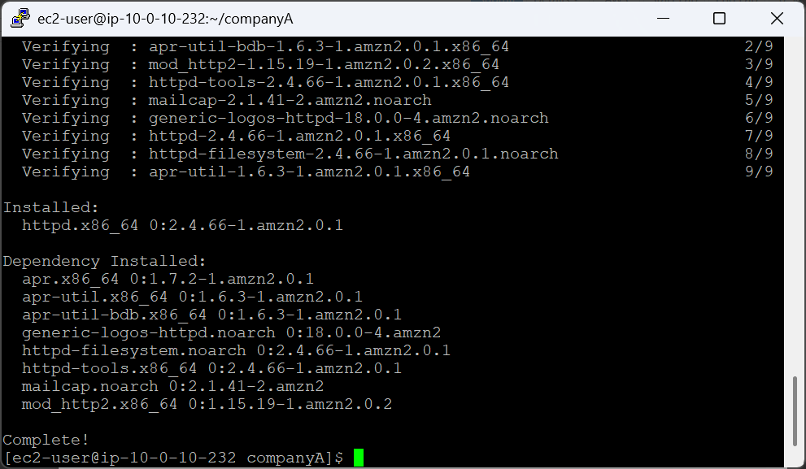
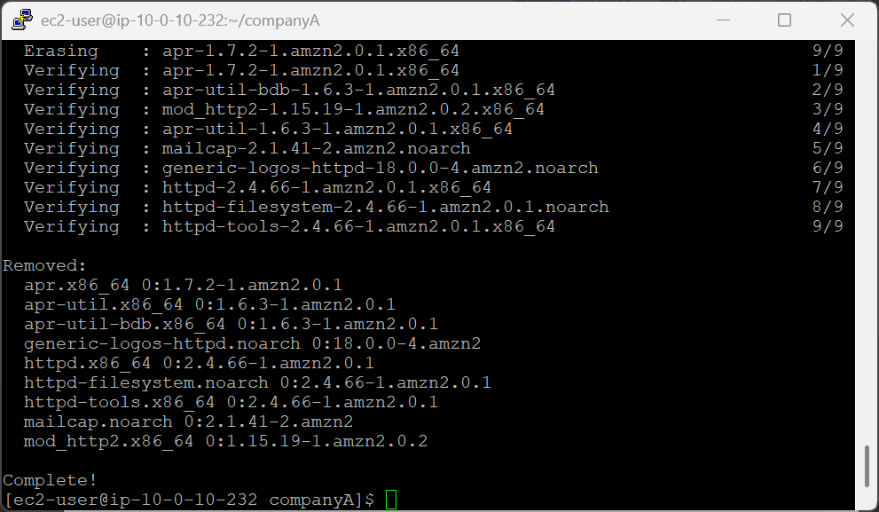
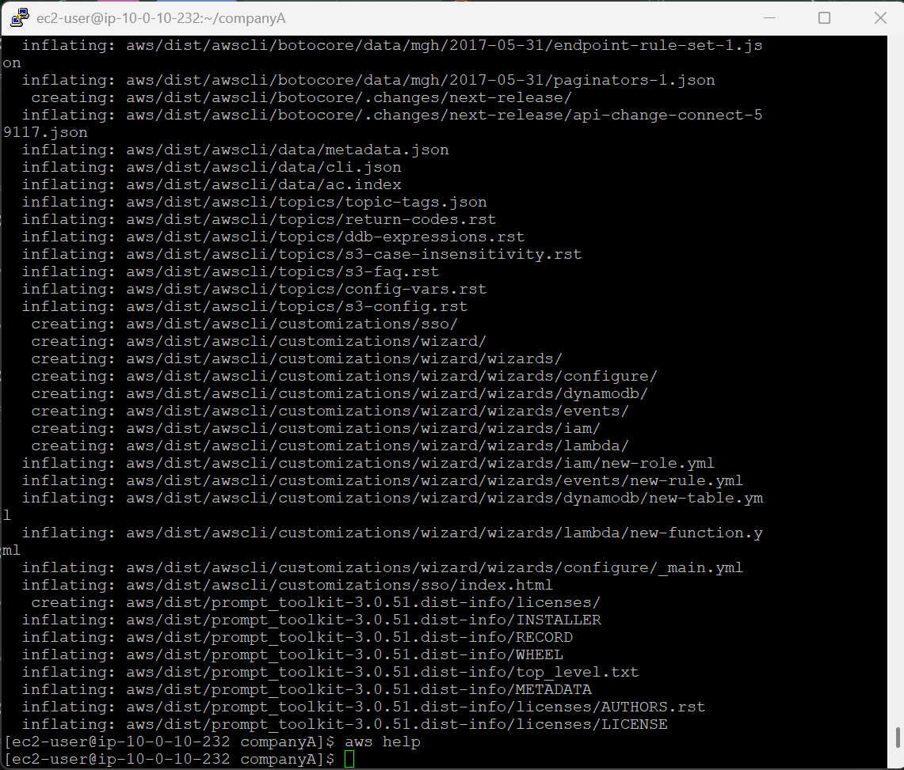
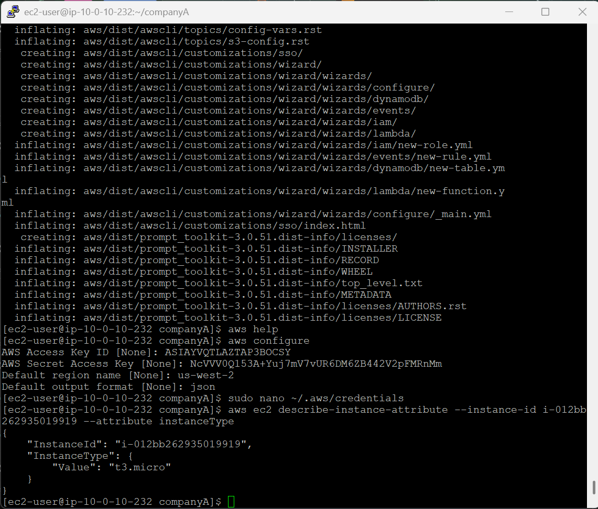
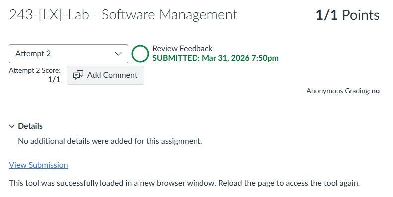

# 243-[LX]-Lab - Software Management

> Dokumentasi panduan koneksi SSH ke EC2, update sistem dengan `yum`, rollback paket, instalasi AWS CLI, dan konfigurasi kredensial.

---

## Tugas 1 — Koneksi SSH ke EC2

### 🪟 Windows (PuTTY)

1. Klik **Details → Show** → **Download PPK** → simpan `labsuser.ppk`
2. Salin **PublicIP** → tutup panel
3. Buka PuTTY → masukkan IP & file `.ppk` di bagian Auth

### 🍎 macOS / Linux (Terminal)

```bash
cd ~/Downloads
chmod 400 labsuser.pem
ssh -i labsuser.pem ec2-user@<public-ip>
```

Ketik **`yes`** saat konfirmasi muncul.


---

## Tugas 2 — Update Sistem dengan `yum`

```bash
pwd && cd companyA                  # Masuk ke direktori companyA

sudo yum -y check-update            # Cek daftar pembaruan tersedia
sudo yum update --security          # Terapkan patch keamanan saja
sudo yum -y upgrade                 # Update seluruh sistem & paket

sudo yum install httpd -y           # Instal web server Apache
```


### Referensi perintah `yum`

| Perintah | Fungsi |
|---|---|
| `yum check-update` | Tampilkan daftar paket yang bisa diperbarui |
| `yum update --security` | Update khusus patch keamanan |
| `yum upgrade` | Update semua paket ke versi terbaru |
| `yum install <paket> -y` | Instal paket tanpa konfirmasi |

---

## Tugas 3 — Rollback Paket (Downgrade)

> Batalkan instalasi paket jika menyebabkan masalah menggunakan riwayat `yum`.

```bash
sudo yum history list               # Tampilkan riwayat semua transaksi yum
sudo yum history info <ID>          # Lihat detail transaksi (opsional)
sudo yum -y history undo <ID>       # Batalkan transaksi berdasarkan ID
```


> Cari nomor ID transaksi instalasi `httpd` dari output `history list`, lalu gunakan ID tersebut pada perintah `undo`.

---

## Tugas 4 — Instalasi AWS CLI v2

Verifikasi Python 3 tersedia:

```bash
python3 --version
```

Unduh, ekstrak, dan instal:

```bash
curl "https://awscli.amazonaws.com/awscli-exe-linux-x86_64.zip" -o "awscliv2.zip"
unzip awscliv2.zip
sudo ./aws/install
aws help           # Verifikasi instalasi berhasil (tekan q untuk keluar)
```


> Sebelum lanjut ke Tugas 5 — buka panel **Details → Show**, salin `aws_access_key_id`, `aws_secret_access_key`, dan `aws_session_token` ke Notepad/Text Editor.

---

## Tugas 5 — Konfigurasi AWS CLI

### Atur konfigurasi dasar

```bash
aws configure
```

Isi parameter berikut saat diminta:

| Parameter | Nilai |
|---|---|
| AWS Access Key ID | *(tekan Enter — kosongkan)* |
| AWS Secret Access Key | *(tekan Enter — kosongkan)* |
| Default region name | `us-west-2` |
| Default output format | `json` |

---

### Edit kredensial secara manual

```bash
sudo nano ~/.aws/credentials
```

Tempelkan blok kredensial dari panel Details:

```
[default]
aws_access_key_id=<your access key ID>
aws_secret_access_key=<your access key>
aws_session_token=<your session token>
```

Simpan: **`Ctrl+O`** → Enter → keluar: **`Ctrl+X`**

---

### Uji koneksi AWS CLI

1. Buka AWS Console → **EC2 → Instances**
2. Salin **Instance ID** dari instans `Command Host` (contoh: `i-1234567890abcdefg`)
3. Jalankan perintah uji:

```bash
aws ec2 describe-instance-attribute \
  --instance-id <ID_Instans_Anda> \
  --attribute instanceType
```


Jika output JSON menampilkan `t3.micro` → AWS CLI berhasil terhubung! ✓

---

### Referensi Perintah

| Perintah | Fungsi |
|---|---|
| `yum history list` | Tampilkan riwayat transaksi paket |
| `yum history undo <ID>` | Batalkan transaksi berdasarkan ID |
| `curl -o file URL` | Unduh file dari URL |
| `unzip file.zip` | Ekstrak arsip zip |
| `aws configure` | Konfigurasi kredensial AWS CLI |
| `aws ec2 describe-instance-attribute` | Query atribut instans EC2 |

---

> 💡 **Tips:** Kredensial lab bersifat sementara dan akan kedaluwarsa. Jika perintah AWS CLI tiba-tiba gagal dengan error `ExpiredToken`, ulangi langkah Tugas 5 dengan kredensial baru dari panel Details.

---

---
<div align="center">

☁️ **AWS re/Start Program** &nbsp;·&nbsp; Hands-on Lab: Sofware Management &nbsp;·&nbsp; ✅ Completed

</div>