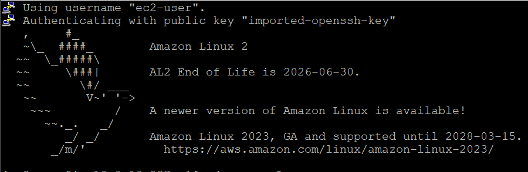
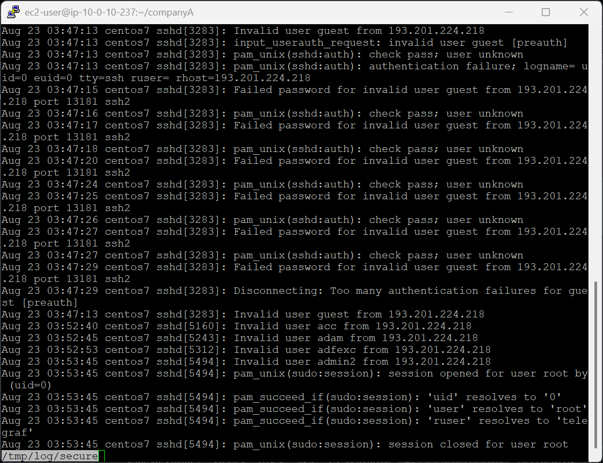
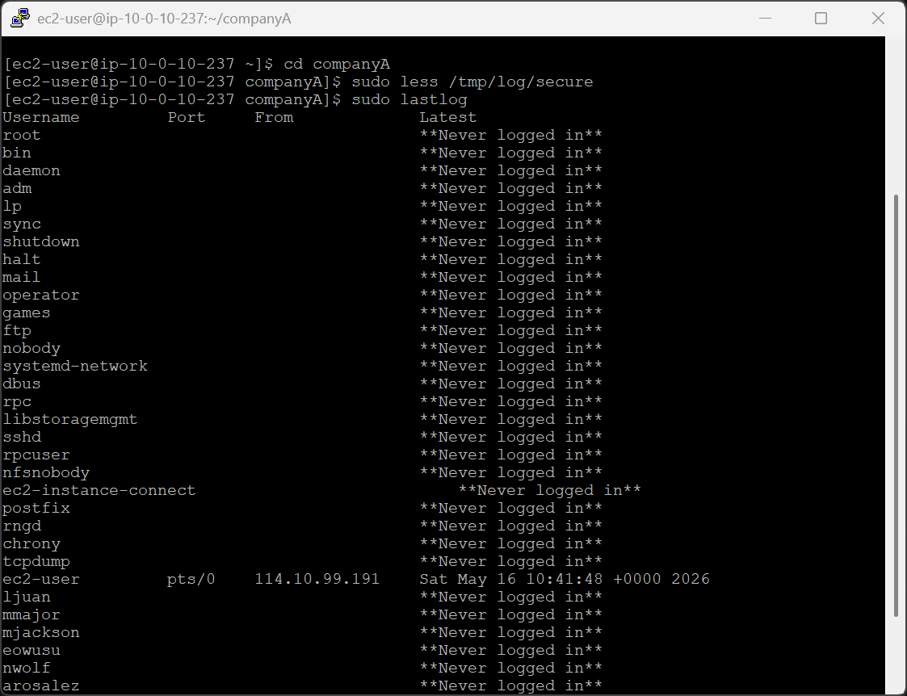
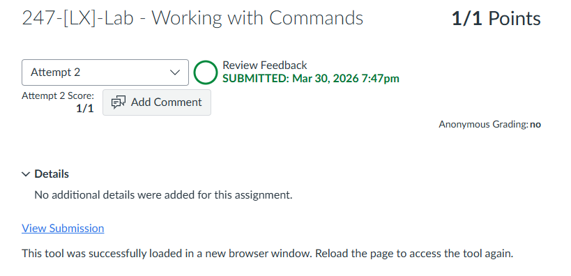

# 245-[LX]-Lab - Managing Log Files

> Dokumentasi panduan koneksi SSH ke EC2, meninjau log keamanan sistem, dan menganalisis riwayat login untuk keperluan audit.

---

## Tugas 1 — Koneksi SSH ke EC2

### 🪟 Windows (PuTTY)

1. Klik **Details → Show** → **Download PPK** → simpan `labsuser.ppk`
2. Salin **PublicIP** → tutup panel
3. Buka PuTTY → masukkan IP & file `.ppk` di bagian Auth → Connect

### 🍎 macOS / Linux (Terminal)

```bash
cd ~/Downloads
chmod 400 labsuser.pem
ssh -i labsuser.pem ec2-user@<public-ip>
```

Ketik **`yes`** saat konfirmasi muncul.


---

## Tugas 2 — Meninjau Log Keamanan

```bash
pwd && cd companyA          # Validasi lokasi & masuk ke folder kerja
```

### A. Log Keamanan (`secure`)

```bash
sudo less /tmp/log/secure   # Baca log aktivitas keamanan sistem
```


Tekan **`q`** untuk keluar dari tampilan log.

> Di lingkungan produksi nyata, file ini berada di `/var/log/secure`.

---

### B. Riwayat Login (`lastlog`)

```bash
sudo lastlog
```


Menampilkan daftar seluruh pengguna di sistem beserta waktu login terakhir mereka, atau status **"Never logged in"** untuk akun yang belum pernah digunakan.

---

## Analisis — Nilai Bisnis dari Log Keamanan

Informasi dari `secure` dan `lastlog` dapat dimanfaatkan untuk berbagai keperluan operasional:

### 🛡️ Deteksi & Mitigasi Ancaman Siber

Data yang relevan: IP penyerang, username yang ditargetkan, frekuensi kegagalan login.

Manfaat: Mengidentifikasi serangan *brute-force* atau *credential stuffing* sejak dini. Tim keamanan dapat langsung memblokir IP berbahaya di level Firewall, Network ACL, atau AWS Security Group.

---

### Referensi Perintah

| Perintah | Fungsi |
|---|---|
| `less /path/file` | Baca file log dengan navigasi (tekan `q` untuk keluar) |
| `sudo lastlog` | Tampilkan riwayat login terakhir semua pengguna |
| `sudo less /tmp/log/secure` | Baca log aktivitas keamanan sistem |

---

> 💡 **Tips:** Jadikan audit log sebagai rutinitas harian — anomali seperti lonjakan kegagalan login dari satu IP adalah tanda peringatan awal yang sering terlewat.

---

---

<div align="center">

☁️ **AWS re/Start Program** &nbsp;·&nbsp; Hands-on Lab: Managing Log Files &nbsp;·&nbsp; ✅ Completed

</div>