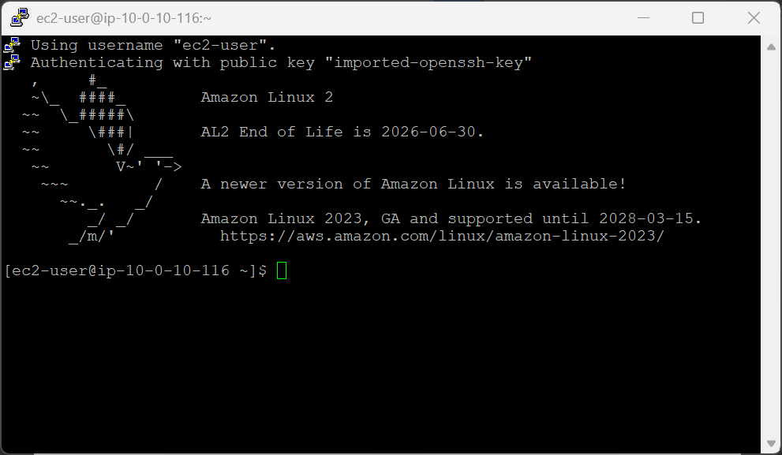
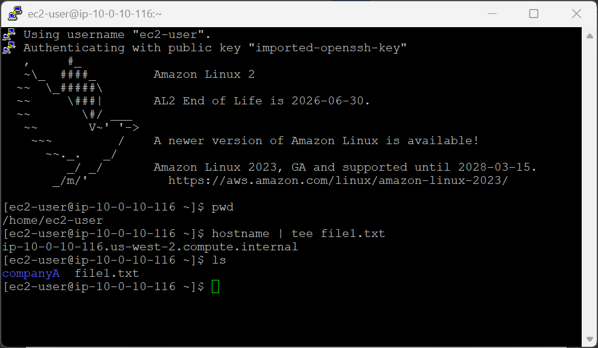
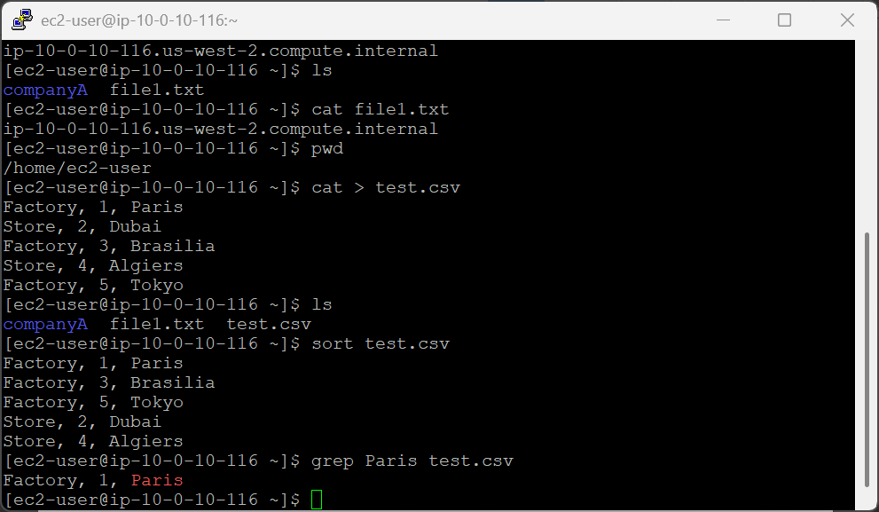
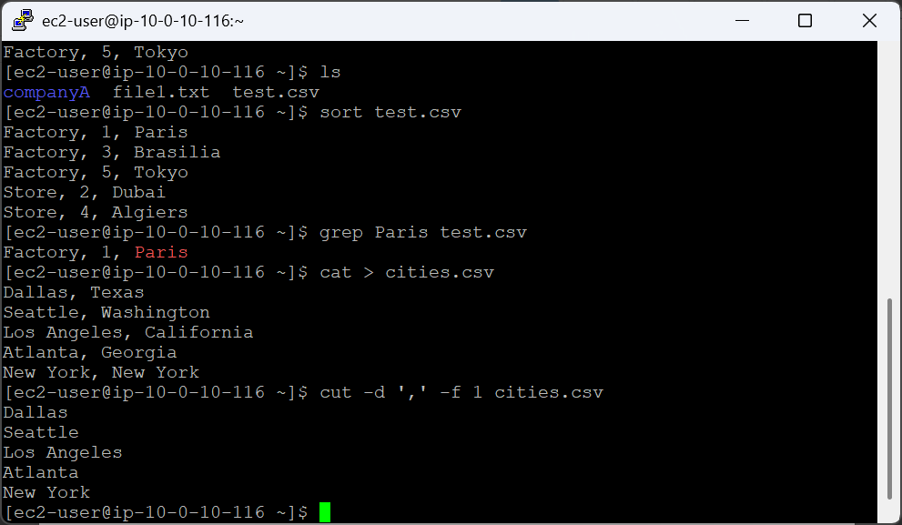
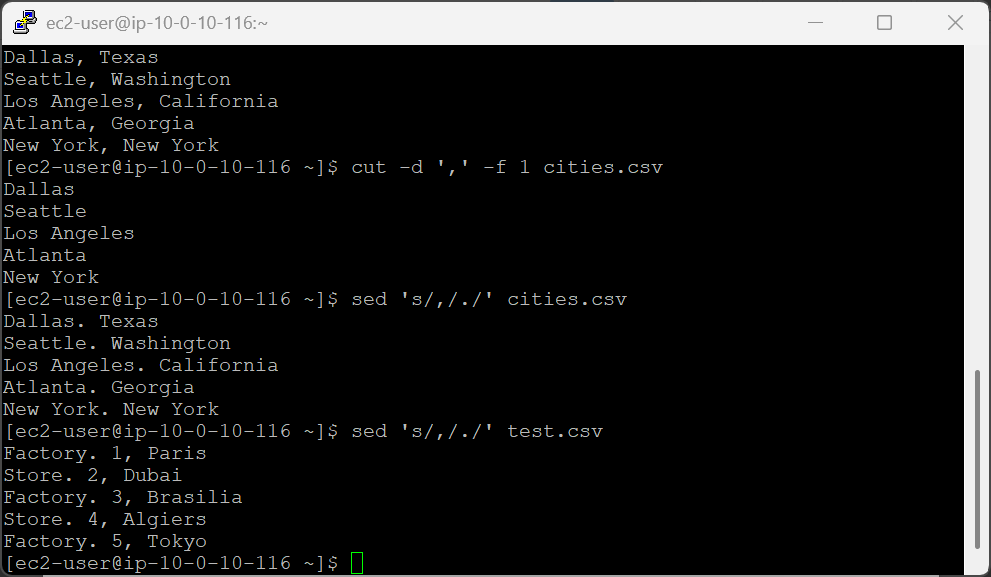

# 247-[LX]-Lab - Working with Commands

> Dokumentasi panduan koneksi SSH ke EC2 dan eksplorasi perintah pemrosesan teks di Linux.

---

## Tugas 1 — Koneksi SSH ke EC2

### Persiapan

1. Klik **Details → Show** di halaman instruksi lab
2. Salin nilai **PublicIP**
3. Unduh kunci akses:
   - **Windows/Mac/Linux:** Download PEM
   - **Windows (PuTTY):** Download PPK
4. Tutup panel

### Koneksi

```bash
cd ~/Downloads
chmod 400 labsuser.pem          
ssh -i labsuser.pem ec2-user@<public-ip>
```

Ketik **`yes`** saat konfirmasi muncul.


---

## Tugas 2 — Perintah `tee`

> Menampilkan output ke layar **sekaligus** menyimpannya ke file.

```bash
pwd                          
hostname | tee file1.txt     
ls                           
```

**Cara kerja:** `hostname` menghasilkan nama server → `|` meneruskan ke `tee` → `tee` menulis ke file & menampilkan di layar bersamaan.

---

## Tugas 3 — Perintah `sort`, `|`, dan `grep`

> Membuat file CSV, mengurutkan isi, dan memfilter baris tertentu.

### Buat file `test.csv`

```bash
cat > test.csv
```

Ketik data berikut, tekan **Enter** setelah baris terakhir, lalu **`Ctrl+D`** untuk menyimpan:

```
Factory, 1, Paris
Store, 2, Dubai
Factory, 3, Brasilia
Store, 4, Algiers
Factory, 5, Tokyo
```

Verifikasi: `ls`

### Urutkan & filter

```bash
# Urutkan berdasarkan abjad & angka
sort test.csv    
# Tampilkan hanya baris yang mengandung "Paris"          
grep Paris test.csv        
```

---

## Tugas 4 — Perintah `cut`

> Mengekstrak kolom tertentu dari file berdasarkan delimiter.

### Buat file `cities.csv`

```bash
cat > cities.csv
```

Ketik data berikut, lalu **`Ctrl+D`**:

```
Dallas, Texas
Seattle, Washington
Los Angeles, California
Atlanta, Georgia
New York, New York
```

### Ekstrak kolom pertama

```bash
cut -d ',' -f 1 cities.csv
```


| Opsi | Fungsi |
|---|---|
| `-d ','` | Tetapkan koma sebagai pemisah (delimiter) |
| `-f 1` | Ambil kolom/field pertama |

---

## Tantangan — Perintah `sed`

> Mengganti teks di dalam file tanpa membuka editor.

```bash
# Ganti koma pertama → titik
sed 's/,/./' cities.csv   
# Ganti koma pertama → titik 
sed 's/,/./' test.csv      
```


**Sintaks:** `sed 's/teks_lama/teks_baru/'` — mengganti kemunculan **pertama** per baris.

---

### Referensi Perintah

| Perintah | Fungsi |
|---|---|
| `tee file` | Tulis output ke layar & file sekaligus |
| `sort file` | Urutkan baris berdasarkan abjad/angka |
| `grep kata file` | Filter baris yang mengandung kata tertentu |
| `cut -d 'x' -f N file` | Ekstrak kolom ke-N dengan delimiter x |
| `sed 's/lama/baru/' file` | Ganti teks pertama per baris |
| `cat > file` + `Ctrl+D` | Buat & isi file langsung dari terminal |

---

> 💡 **Tips:** Kombinasikan perintah ini dengan `|` — misalnya `sort test.csv | grep Factory` untuk mengurutkan **lalu** memfilter sekaligus.

---

---

<div align="center">

☁️ **AWS re/Start Program** &nbsp;·&nbsp; Hands-on Lab: Working with Commands &nbsp;·&nbsp; ✅ Completed

</div>