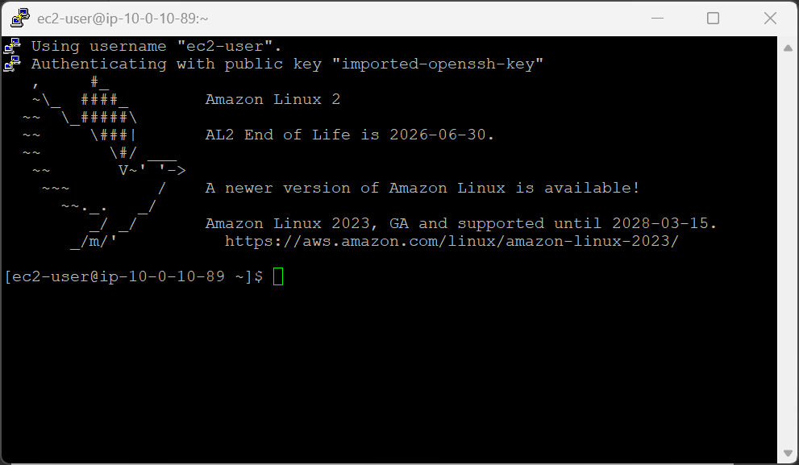
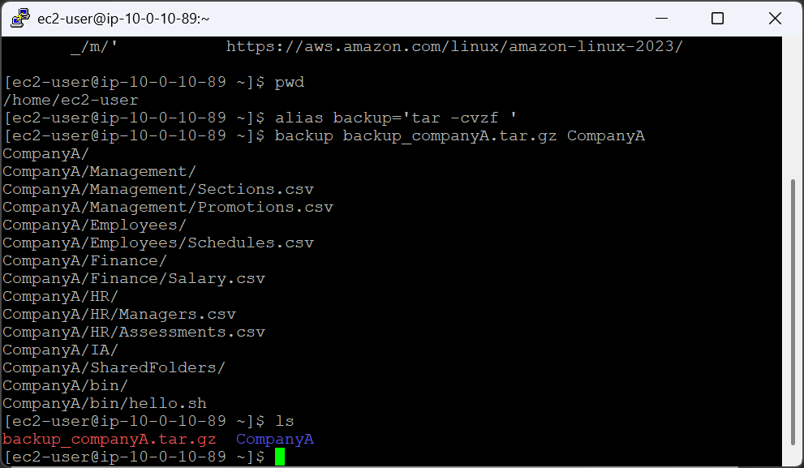
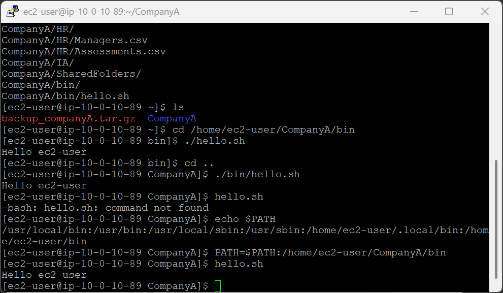
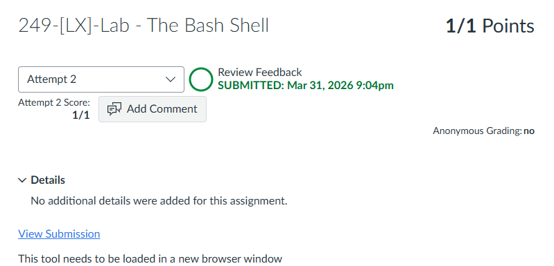

# 249-[LX]-Lab - The Bash Shell

> Dokumentasi panduan koneksi SSH ke EC2, membuat alias perintah kustom, dan memodifikasi variabel `$PATH`.

---

## Tugas 1 — Koneksi SSH ke EC2

### Persiapan

1. Klik **Details → Show** di halaman instruksi lab
2. Salin nilai **PublicIP**
3. Unduh kunci akses:
   - **Windows/Mac/Linux:** Download PEM
   - **Windows (PuTTY):** Download PPK
4. Tutup panel

### Koneksi

```bash
cd ~/Downloads
chmod 400 labsuser.pem          # Khusus macOS/Linux
ssh -i labsuser.pem ec2-user@<public-ip>
```

Ketik **`yes`** saat konfirmasi muncul.


---

## Tugas 2 — Membuat Alias Backup

> Buat pintasan perintah `tar` agar tidak perlu mengetik opsi lengkap setiap saat.

```bash
pwd    # Pastikan berada di /home/ec2-user

# Buat alias
alias backup='tar -cvzf '

# Gunakan alias untuk backup folder CompanyA
backup backup_companyA.tar.gz CompanyA

# Verifikasi file arsip berhasil dibuat
ls
```


### Opsi `tar` yang digunakan

| Opsi | Fungsi |
|---|---|
| `-c` | Buat arsip baru |
| `-v` | Tampilkan proses (verbose) |
| `-z` | Kompresi format `.gz` (gzip) |
| `-f` | Tentukan nama file output |

---

## Tugas 3 — Variabel Lingkungan `$PATH`

> Pahami cara Linux mencari executable dan tambahkan direktori kustom agar skrip bisa dijalankan dari mana saja.

### Jalankan skrip dengan relative path

```bash
cd /home/ec2-user/CompanyA/bin
./hello.sh              # Output: hello ec2-user

cd ..
./bin/hello.sh          # Juga berhasil — path lengkap dari direktori saat ini
```

### Simulasi error tanpa path

```bash
hello.sh                # bash: hello.sh: command not found
```

> Linux tidak menemukan skrip karena foldernya belum terdaftar di `$PATH`.

### Cek & perbarui `$PATH`

```bash
echo $PATH              # Tampilkan daftar direktori yang dicari sistem

# Tambahkan direktori kustom ke PATH
PATH=$PATH:/home/ec2-user/CompanyA/bin

# Verifikasi — jalankan tanpa ./ dari direktori mana pun
hello.sh                # Output: hello ec2-user ✓
```


### Cara kerja `$PATH`

```
PATH=/usr/bin:/bin:/usr/local/bin:/home/ec2-user/CompanyA/bin
       ↑           ↑                ↑
  Direktori sistem bawaan      Direktori kustom yang baru ditambahkan
```

Setiap kali menjalankan perintah, Linux mencari file executable di setiap direktori dalam `$PATH` dari kiri ke kanan hingga ditemukan.

---

### Referensi Perintah

| Perintah | Fungsi |
|---|---|
| `alias nama='perintah'` | Buat pintasan perintah |
| `tar -cvzf arsip.tar.gz folder` | Buat arsip terkompresi |
| `echo $PATH` | Tampilkan variabel PATH saat ini |
| `PATH=$PATH:/dir/baru` | Tambahkan direktori ke PATH |
| `./skrip.sh` | Jalankan skrip dengan relative path |

---

> ⚠️ **Catatan:** Perubahan `PATH` dengan cara ini bersifat **sementara** — hanya berlaku selama sesi terminal aktif. Untuk permanen, tambahkan ke file `~/.bashrc` atau `~/.bash_profile`.

---

---

<div align="center">

☁️ **AWS re/Start Program** &nbsp;·&nbsp; Hands-on Lab: The Bash Shell &nbsp;·&nbsp; ✅ Completed

</div>