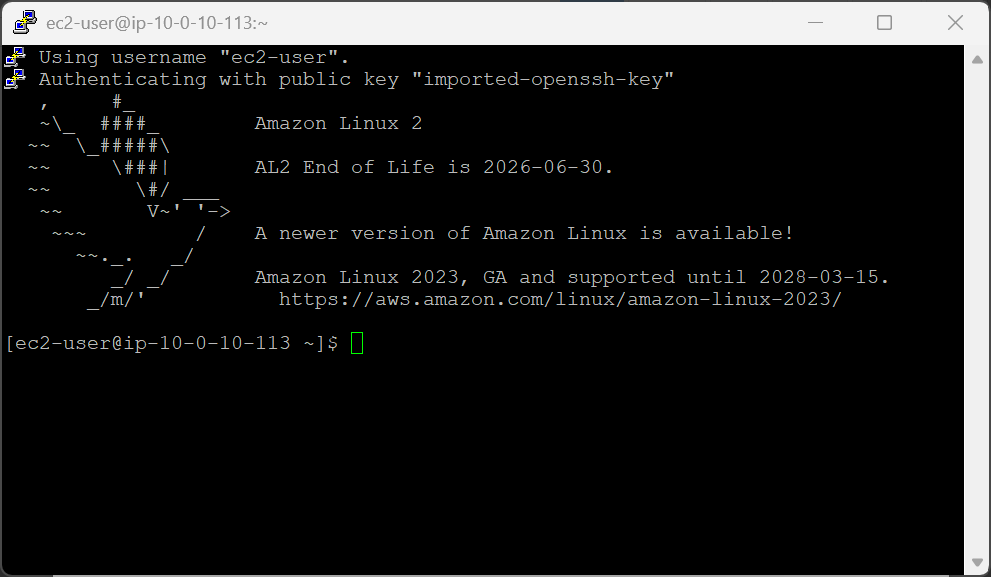
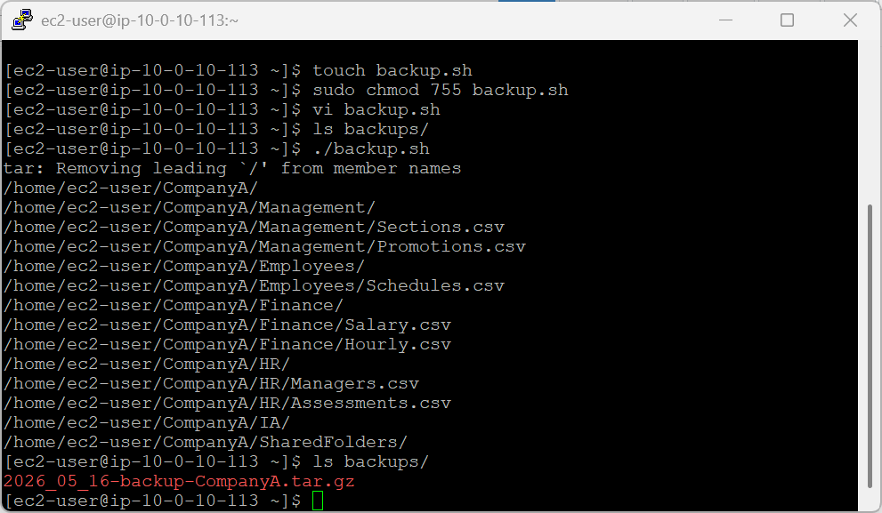
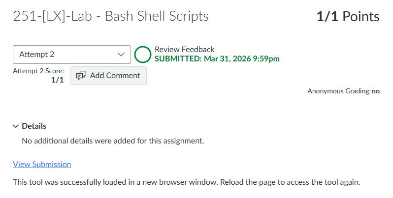

# 251-[LX]-Lab - Bash Shell Scripts

> Dokumentasi panduan koneksi SSH ke EC2 dan membuat skrip Bash untuk mengotomatiskan backup folder dengan nama file dinamis berbasis tanggal.

---

## Tugas 1 — Koneksi SSH ke EC2

### Persiapan

1. Klik **Details → Show** di halaman instruksi lab
2. Salin nilai **PublicIP**
3. Unduh kunci akses:
   - **Windows/Mac/Linux:** Download PEM
   - **Windows (PuTTY):** Download PPK
4. Tutup panel

### Koneksi

```bash
cd ~/Downloads
chmod 400 labsuser.pem          # Khusus macOS/Linux
ssh -i labsuser.pem ec2-user@<public-ip>
```

Ketik **`yes`** saat konfirmasi muncul.


---

## Tugas 2 — Menulis Skrip Shell Backup

```bash
pwd                         # Pastikan berada di /home/ec2-user
touch backup.sh             # Buat file skrip kosong
sudo chmod 755 backup.sh    # Beri izin eksekusi
vi backup.sh                # Buka editor
```

Tekan **`i`** untuk masuk ke Insert Mode, lalu ketik skrip berikut:

```bash
#!/bin/bash
DAY="$(date +%Y_%m_%d)"
BACKUP="/home/$USER/backups/$DAY-backup-CompanyA.tar.gz"
tar -csvpzf $BACKUP /home/$USER/CompanyA
```

Simpan dan keluar: **`Esc`** → `:wq` → **Enter**

---

### Jalankan & verifikasi

```bash
./backup.sh         # Eksekusi skrip
ls backups/         # Verifikasi file arsip terbuat
```

Output contoh: `2021_08_31-backup-CompanyA.tar.gz`

---

### Anatomi skrip `backup.sh`

| Baris | Penjelasan |
|---|---|
| `#!/bin/bash` | Shebang — menentukan interpreter yang digunakan |
| `DAY="$(date +%Y_%m_%d)"` | Ambil tanggal hari ini sebagai nama dinamis |
| `BACKUP="/home/$USER/backups/..."` | Tentukan path & nama file output |
| `tar -csvpzf $BACKUP /home/$USER/CompanyA` | Buat arsip terkompresi dari folder CompanyA |

> `$USER` otomatis terisi dengan nama pengguna yang sedang login (`ec2-user`).

---

### Izin file `chmod 755`

| Digit | Untuk | Izin |
|---|---|---|
| `7` | Pemilik (owner) | `rwx` — baca, tulis, eksekusi |
| `5` | Grup | `r-x` — baca & eksekusi |
| `5` | Lainnya (others) | `r-x` — baca & eksekusi |

---

### Referensi Perintah

| Perintah | Fungsi |
|---|---|
| `touch file.sh` | Buat file kosong |
| `chmod 755 file.sh` | Beri izin eksekusi pada skrip |
| `./file.sh` | Jalankan skrip dari direktori saat ini |
| `date +%Y_%m_%d` | Format tanggal: `YYYY_MM_DD` |
| `tar -csvpzf` | Buat arsip terkompresi gzip |

---

> 💡 **Tips:** Tambahkan skrip ini ke cron job (`crontab -e`) agar backup berjalan otomatis setiap hari tanpa perlu dijalankan manual.

---

---

<div align="center">

☁️ **AWS re/Start Program** &nbsp;·&nbsp; Hands-on Lab: Bash Shell Scripts &nbsp;·&nbsp; ✅ Completed

</div>