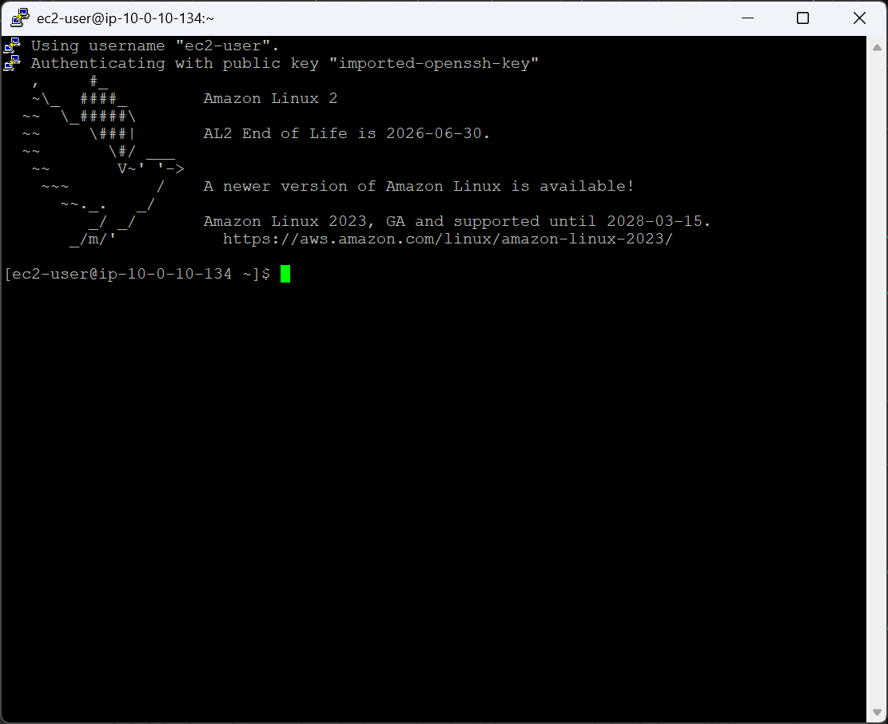
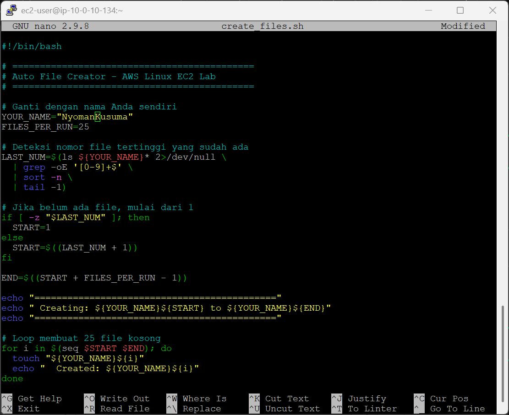
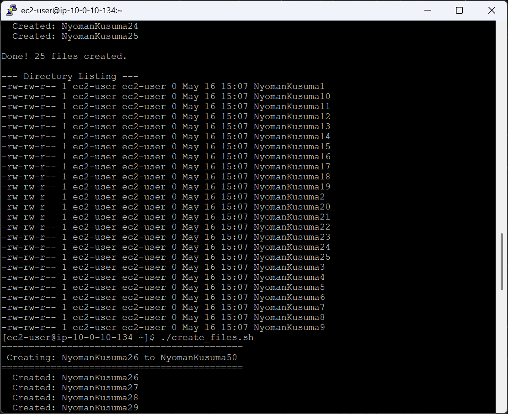
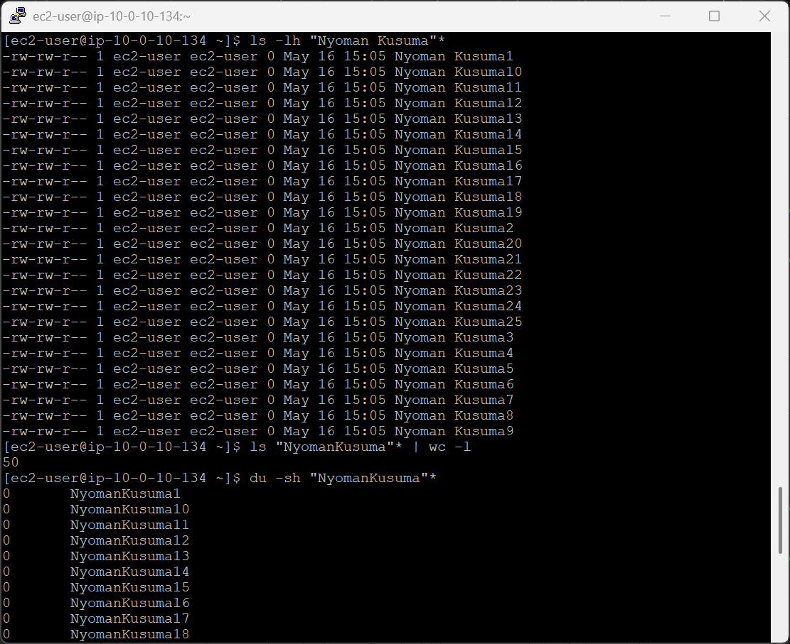
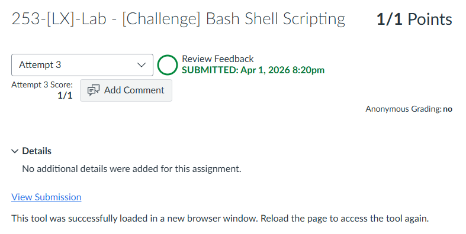

# 253-[LX]-Lab - [Challenge] Bash Shell Scripting

> Dokumentasi panduan koneksi SSH ke EC2, menulis script Bash otomatis dengan auto-increment, dan memvalidasi hasilnya.

---

## Fase 1 — Koneksi SSH ke EC2

### Persiapan

1. Klik **Details → Show** di halaman instruksi lab
2. Salin nilai **PublicIP**
3. Unduh kunci akses:
   - **Windows/Mac/Linux:** Download PEM
   - **Windows (PuTTY):** Download PPK
4. Tutup panel

### Koneksi

```bash
cd ~/Downloads
chmod 400 labsuser.pem          # Khusus macOS/Linux
ssh -i labsuser.pem ec2-user@<public-ip>
```

Ketik **`yes`** saat konfirmasi muncul.


---

## Fase 2 — Membuat Script di EC2

### Buat & tulis script

```bash
nano create_files.sh
```

Ketik script berikut di dalam editor:

```bash
#!/bin/bash

# ============================================
# Auto File Creator - AWS Linux EC2 Lab
# ============================================

# Ganti dengan nama Anda sendiri
YOUR_NAME="yourName"
FILES_PER_RUN=25

# Deteksi nomor file tertinggi yang sudah ada
LAST_NUM=$(ls ${YOUR_NAME}* 2>/dev/null \
  | grep -oE '[0-9]+$' \
  | sort -n \
  | tail -1)

# Jika belum ada file, mulai dari 1
if [ -z "$LAST_NUM" ]; then
  START=1
else
  START=$((LAST_NUM + 1))
fi

END=$((START + FILES_PER_RUN - 1))

echo "============================================"
echo " Creating: ${YOUR_NAME}${START} to ${YOUR_NAME}${END}"
echo "============================================"

for i in $(seq $START $END); do
  touch "${YOUR_NAME}${i}"
  echo "  Created: ${YOUR_NAME}${i}"
done

echo ""
echo "Done! $FILES_PER_RUN files created."
echo ""

echo "--- Directory Listing ---"
ls -lh ${YOUR_NAME}*
```

Simpan dan keluar: **`Ctrl+O`** → Enter → **`Ctrl+X`**

---

### Beri izin eksekusi

```bash
chmod +x create_files.sh
```


---

## Fase 3 — Menjalankan & Validasi Script

### Run pertama — batch 1–25

```bash
./create_files.sh
```

Output yang diharapkan:

```
============================================
 Creating: yourName1 to yourName25
============================================
  Created: yourName1
  Created: yourName2
  ...
  Created: yourName25

Done! 25 files created.

--- Directory Listing ---
-rw-rw-r-- 1 ec2-user ec2-user 0 May 16 10:00 yourName1
...
```

### Run kedua — auto-increment ke 26–50

```bash
./create_files.sh
```


Script otomatis mendeteksi file terakhir (`yourName25`) dan melanjutkan dari `yourName26` hingga `yourName50`.

---

### Validasi manual

```bash
ls -lh yourName*        # Tampilkan semua file dengan detail
ls yourName* | wc -l    # Hitung total file yang dibuat
du -sh yourName*        # Pastikan semua file berukuran 0 bytes
```

---

## Kesimpulan

| Prinsip | Penerapan dalam Script |
|---|---|
| **No hardcoded value** | Semua angka dihitung dinamis dari kondisi direktori aktual |
| **Idempotent & Incremental** | Setiap run menghasilkan 25 file baru melanjutkan urutan sebelumnya |
| **Self-validating** | Directory listing otomatis dicetak di akhir setiap run |
| **Portabel** | Kompatibel dengan Amazon Linux 2, AL2023, Ubuntu, dan distro Linux lainnya |

---

> 💡 **Tips:** Ubah nilai `FILES_PER_RUN` di baris kedua script untuk mengontrol jumlah file yang dibuat per eksekusi — tidak perlu modifikasi lain.

---

---

<div align="center">

☁️ **AWS re/Start Program** &nbsp;·&nbsp; Hands-on Lab: Bash Shell Scripting &nbsp;·&nbsp; ✅ Completed

</div>